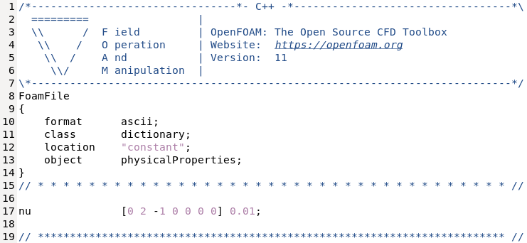
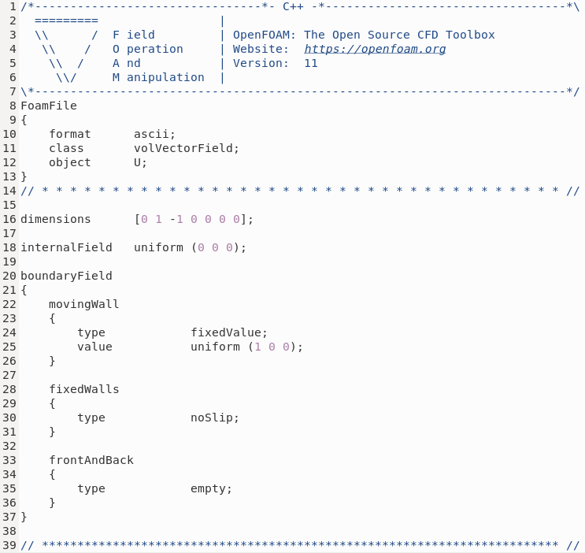
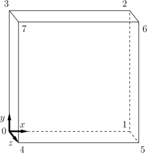
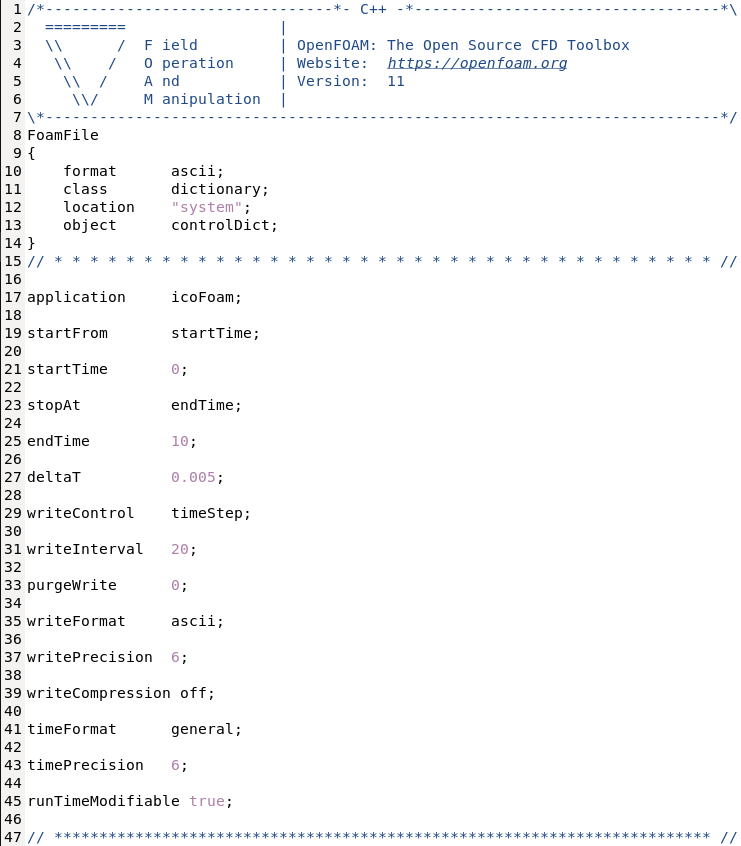

# Tutorial 1.2 - Setting Up the Lid-Driven Cavity Problem in OpenFOAM

##  Table of Contents
- [Tutorial 1.2 - Setting Up the Lid-Driven Cavity Problem in OpenFOAM](#tutorial-12---setting-up-the-lid-driven-cavity-problem-in-openfoam)
  - [Table of Contents](#table-of-contents)
  - [Introduction](#introduction)
  - [Editor Setup](#editor-setup)
  - [Getting Started](#getting-started)
  - [Directory Structure Overview](#directory-structure-overview)
  - [Modifying Physical Properties](#modifying-physical-properties)
  - [Reviewing the Velocity File](#reviewing-the-velocity-file)
  - [Reviewing the Pressure File](#reviewing-the-pressure-file)
  - [Reviewing Mesh Setup](#reviewing-mesh-setup)
    - [What is a mesh?](#what-is-a-mesh)
    - [How mesh is handled in OpenFOAM?](#how-mesh-is-handled-in-openfoam)
    - [Reviewing the blockMeshDict file](#reviewing-the-blockmeshdict-file)
  - [Reviewing the controlDict File](#reviewing-the-controldict-file)
  - [Brief Overview of the fvSchemes and fvSolution Files:](#brief-overview-of-the-fvschemes-and-fvsolution-files)
    - [The fvSchemes file](#the-fvschemes-file)
    - [The fvSolution file](#the-fvsolution-file)
    - [Further detailing in upcoming tutorials](#further-detailing-in-upcoming-tutorials)
  - [Running the Case](#running-the-case)
  - [References](#references)

## Introduction

In [Tutorial 0](../../Tutorial_0/README.md), we ran the lid-driven cavity (LDC) case, which is one of the many pre-configured tutorials that **OpenFOAM** provides. The directory where these tutorials are located is indicated by the '\$FOAM_TUTORIALS' variable in the **OpenFOAM** environment. To list the top-level contents of the '\$FOAM_TUTORIALS' directory, type the following command in your Linux terminal:

```bash
ls $FOAM_TUTORIALS
```

> [!CAUTION]
> Beginners and those unfamiliar with Linux or programming should avoid altering the contents of the original installation directory, identified by the '\$WM_PROJECT_DIR' variable. Making changes without sufficient expertise could disrupt the software setup, necessitating a full reinstallation.

## Editor Setup

Before you begin editing files in **OpenFOAM**, set up a text editor that supports the functionalities you need. For a basic editor, you can install `gedit`:

```bash
sudo apt update
```

```bash
sudo apt install gedit
```

For a more powerful editing experience, "Visual Studio Code" (VS Code) offers extensive capabilities, including integration with `wsl`.

## Getting Started

Let's proceed by setting up your own working copy of the tutorial. 

You'll need to navigate to the '\$FOAM_RUN' directory and create a new directory called "cavity2d" where you will copy the tutorial content:

```bash
cd $FOAM_RUN
```

```bash
mkdir cavity2d
```

```bash
cp -r $FOAM_TUTORIALS/legacy/incompressible/icoFoam/cavity/cavity/* cavity2d/
```

This setup ensures that you have a personal copy of the tutorial, allowing you to experiment and make changes without affecting the original file.

> [!TIP]
> You can create a shortcut to your '\$FOAM_RUN' directory by creating an alias:
> 
> Open the configuration file in a text editor:
> 
>  ```bash
>  cd
>  ```
>
>  ```bash
>  gedit ~/.bashrc
>  ```
>
> Scroll to the end of the file and add the following line:
> 
> ```bash
> alias run='cd $FOAM_RUN'
> ```
>
> After adding the alias, save the file and exit the text editor.
> 
> To apply the changes, you need to source the configuration file:
> 
> ```bash
>  source ~/.bashrc
>  ```
>
> Now, you can use the alias to navigate to your '\$FOAM_RUN' directory by simply typing:
> 
> ```bash
>  run
>  ```

## Directory Structure Overview

After copying the tutorial files, you can explore the contents of your new 'cavity2d' directory to understand how **OpenFOAM** organizes its case files. Use the 'ls' command to list the directories and files:

```bash
cd cavity2d
```

```bash
ls
```

You should see three main directories: 

```
cavity2d
├── 0
├── constant
└── system
```

Each directory plays a crucial role in defining the setup and execution of **OpenFOAM** simulations:
1. '0': This directory holds the setup files for primary field variables such as velocity ($`U`$), pressure ($`p`$), and any other scalar or vector fields relevant to the simulation. Each file represents a different variable and specifies initial conditions and boundary conditions for that variable.
2. 'constant': This directory stores data that remains constant throughout the simulation, including physical properties of the fluids ('physicalProperties'), the thermodynamic properties, and the mesh ('polyMesh').
3. 'system': This directory holds configuration files that control the simulation's execution. These files define the solver settings, discretization schemes, and algorithms used during the run.

## Modifying Physical Properties

Now we can delve into the specifics of the simulation parameters. 

Navigate to the 'constant' directory in your 'cavity2d' folder, and open the 'physicalProperties' file. 

```bash
gedit constant/physicalProperties
```

Here’s what you will see in the file:



Each property in the 'physicalProperties' is associated with a set of dimensions, which **OpenFOAM** uses to verify dimensional consistency throughout the simulation. The dimensions are represented in square brackets as:

```cpp
[mass (kg), length (m), time (s), temperature (K), moles (mol), current (A),  luminousIntensity (cd)]
```

'nu' is the kinematic viscosity ($`\nu`$) which is the ratio between the dynamic viscosity and the density of a fluid. The SI unit of the kinematic viscosity is $`\frac{m^2}{s}`$, thus the length is set to 2 and the time to -1. 

From the previous discussion on nondimensionalization, you're aware that when dealing with nondimensional forms of the transport equations, $\nu$ can be represented as the reciprocal of the required $`Re`$ ($`\rho=1$ and $\mu=\frac{1}{Re}`$). To adjust $`\nu`$ according to a specific $`Re`$, you would calculate the desired $`Re`$ and set $`\nu`$ accordingly:

```cpp
nu              [0 2 -1 0 0 0 0] 1/Re;
```

In out case we have $`\nu=0.01`$, thus $`Re = 100`$.

Save and exit.

## Reviewing the Velocity File

Now, let's examine and verify the initial conditions specified in the 'U' (velocity) file. 

Navigate to the "0" directory and list the files using the 'ls' command.

```bash
cd $FOAM_RUN/cavity2d/0
```

```bash
ls
```

Open the 'U' file:

```bash
gedit U
```

You will see the following:



The units for velocity are represented as $`\frac{m}{s}`$, with length set to 1 and time to -1. 

Velocity in **OpenFOAM** is a vector field, represented by three components corresponding to x, y, and z directions in the Cartesian coordinate system. This representation allows for the specification of flow direction and magnitude across three-dimensional space. 

At the start of the simulation, the entire domain's internal field is initialized to a uniform velocity of zero, indicating no initial motion within the fluid:

```cpp
internalField   uniform (0 0 0);
```

Boundary conditions for the walls are defined with fixed values. Specifically, the top wall is assigned a non-zero velocity to represent the moving lid, while the other walls are set to zero velocities, reflecting the no-slip condition.

The 'empty' boundary condition simplifies the model to behave like a 2D simulation because **OpenFOAM** inherently operates in 3D. This condition is applied to faces of the computational domain that would normally represent the depth in a full 3D simulation.

## Reviewing the Pressure File

Next, examine the 'p' (pressure) file, which establishes the initial and boundary conditions for pressure.


Note that the dimensions specified in the file are $`\frac{m^2}{s^{-2}}`$, which are not typical dimensions for pressure. This is because the pressure field managed within the solver is not absolute pressure but a modified version: pressure divided by density ($`\frac{p}{\rho}`$). This modification simplifies the momentum equations and proves particularly beneficial in simulations involving constant density (i.e., incompressible flows). 

Boundary conditions for the walls are set to zero-gradient, and at the start of the simulation, the entire domain's internal pressure is initialized to zero.

## Reviewing Mesh Setup

### What is a mesh?

In CFD, a mesh is a network of geometrically arranged points that divide the simulation domain into discrete cells or elements. This mesh serves as the framework on which the equations of fluid dynamics are solved. Each cell within the mesh represents a small volume of the physical space, and the fluid properties within that volume are calculated and analyzed during the simulation.

A mesh is essential for numerically solving the complex equations that describe fluid flow and other related physical phenomena. By breaking down a continuous domain into smaller discrete elements, a mesh allows for the approximation of physical quantities like velocity, pressure, and temperature at specific points in space and time. This discrete representation is crucial for performing simulations that would otherwise be analytically intractable due to the nonlinear nature of the governing equations in fluid dynamics.

### How mesh is handled in OpenFOAM?

**OpenFOAM** utilizes the finite volume method (FVM). In FVM the integral forms of the conservation laws (mass, momentum, and energy) are applied over discrete control volumes, which are the cells defined by the mesh. In **OpenFOAM**, meshes are created and manipulated using several utilities and configurations, which can be specified in files like 'blockMeshDict' within the 'system' directory of a case.

One of the tools **OpenFOAM** provides is `blockMesh` which is used for creating structured meshes by defining vertices, blocks, and boundary conditions in the 'blockMeshDict' file. This file outlines the mesh geometry, resolution, and topology. Properly defining the mesh also involves setting up boundary and initial conditions that dictate how the simulation interacts with the mesh boundaries, ensuring that these interactions are physically representative of the actual conditions.

### Reviewing the blockMeshDict file

Now, navigate to the 'system' directory to open and review the 'blockMeshDict' file.

```bash
cd $FOAM_RUN/cavity2d/system
```

```bash
gedit blockMeshDict
```

In the file you'll see several sections:

1. convertToMeters:
   
   The 'convertToMeters' parameter is used to convert the units of length used in the mesh definition to meters. For example, if the mesh dimensions were defined in millimeters, 'convertToMeters' would be set to 0.001 to convert these dimensions to meters. For the LDC problem, where dimensions are typically specified directly in meters, 'convertToMeters' should be set to 1.

   ```cpp
   convertToMeters 1.0;
   ```

2. Vertices:
   
   The vertices section of 'blockMeshDict' outlines the coordinates of points in the 3D space that define the corner points of the mesh. For the LDC problem, which can often be treated as quasi-2D, the mesh may slightly extend into the third dimension to accommodate **OpenFOAM**’s inherently 3D calculations.

   ```cpp
   vertices
   (
    (0 0 0)        // vertex number 0
    (1 0 0)	    // vertex number 1
    (1 1 0)	    // vertex number 2
    (0 1 0)	    // vertex number 3
    (0 0 0.1)     	// vertex number 4
    (1 0 0.1)	    // vertex number 5
    (1 1 0.1)	    // vertex number 6
    (0 1 0.1)	    // vertex number 7
   );
   ```

   <figure>
   
   <figcaption>

   Figure: Block structure of the mesh for the cavity [openfoam.com](https://www.openfoam.com/documentation/tutorial-guide/2-incompressible-flow/2.1-lid-driven-cavity-flow).

   </figcaption>
   </figure>

   This setup specifies that vertex 0 is the origin, and other vertices are defined relative to this origin. Vertex 4, for example, is directly behind vertex 0 if looking along the z-axis.

3. Blockes:
   
   The blocks section is for defining how the computational domain is segmented into smaller, controllable hexahedral (hex) elements, which are essential for the mesh-based solution of flow equations. Each block is defined by specifying the indices of its corner vertices, the number of cells into which the block is divided along each axis (x, y, z), and the cell distribution grading within the block. 

   In our file the entry is:

   ```cpp
   blocks
   (
      hex (0 1 2 3 4 5 6 7) (20 20 1) simpleGrading (1 1 1)
   );
   ```

   This indicates a hexahedral block formed by vertices 0 through 7, divided into 20 cells in both x and y directions and just one cell in the z-direction, which is common in simulations effectively treated as 2D due to the 'empty' boundary condition on the front and back faces. The 'simpleGrading' of (1 1 1) denotes uniform cell sizing across the block. This structured approach allows control over mesh resolution and cell shape, impacting both the accuracy of the simulation and the computational resources required.

4. Boundary:

   The boundary section categorizes different parts of the mesh perimeter into named patches, each corresponding to a physical boundary with specific characteristics. Each entry within the boundary section has a set of properties:
   - Type: This property specifies the nature of the boundary, such as whether it is a wall, an inlet, an outlet, or a symmetry plane.
   - Faces: This property lists the indices of the vertices that define the boundary face. These indices correspond to the vertices defined in the vertices section of the 'blockMeshDict' file. Each face is usually defined by a tuple of four vertex indices, outlining a quadrilateral patch on the boundary of the mesh.

      ```cpp
      boundary
      (
         movingWall
         {
            type wall;
            faces
            (
                  (3 7 6 2)
            );
         }
         fixedWalls
         {
            type wall;
            faces
            (
                  (0 4 7 3)
                  (2 6 5 1)
                  (1 5 4 0)
            );
         }
         frontAndBack
         {
            type empty;
            faces
            (
                  (0 3 2 1)
                  (4 5 6 7)
            );
         }
      );
      ```
   
   An essential aspect of setting up boundary conditions in the 'blockMeshDict' is the consistency in naming the boundaries. The names given to different boundary sections in the 'blockMeshDict' must match exactly with those used in the field definition files like 'U' (velocity) and 'p' (pressure). This consistency ensures that **OpenFOAM** correctly applies the boundary conditions specified for velocity and pressure to the corresponding sections of the mesh.

For further reading go to [OpenFOAM v11 User Guide - blockMesh](https://doc.cfd.direct/openfoam/user-guide-v11/blockmesh). This resource offers detailed information on everything from basic mesh setup to advanced configurations involving grading and curved geometries.

## Reviewing the controlDict File

The 'controlDict' file in **OpenFOAM**'s system directory outlines key operational settings that dictate the overall management of the simulation process, from the initiation to the conclusion, including how data is stored and managed. 

Open the 'controlDict' file in the 'system' directory, and you will see the following:



The file contains several critical settings:

1. Application: 
   
   Specifies the solver that will be used for the simulation, tailored to the specific physical phenomena being modeled. Different solvers are available for a variety of engineering and physics problems.
2. StartTime and EndTime: 
   
   These parameters define the temporal bounds of your simulation. 'startTime' is typically set to zero for new simulations or a specific value if continuing from a previous run. 'endTime' is set based on either the physical time scale of the problem or after a desired number of iterations, determining when the simulation will stop.
3. DeltaT: 
   
   This is the time step size for the simulation. It's a crucial parameter that must be carefully selected to balance accuracy and computational efficiency. Smaller time steps generally provide more precise results but require more computational resources.
4. WriteControl and WriteInterval: 
   
   These settings manage how often the simulation results are written to disk. 'writeControl' determines the criterion (like every fixed number of time steps or simulation time), and 'writeInterval' specifies the interval at which outputs are saved.
5. PurgeWrite: 
   
   A practical feature that helps manage disk space by limiting the number of saved output directories. For instance, setting it to 2 keeps only the two most recent sets of outputs.
6. RunTimeModifiable: 
   
   Allows the configuration files to be modified during the runtime of the simulation. **OpenFOAM** will re-read them at the beginning of the next time step, which is particularly useful for adjusting settings without restarting the simulation.
   
Let's change the following lines:

```cpp
endTime         50;

writeControl    runTime;
writeInterval   1;
```
   
## Brief Overview of the fvSchemes and fvSolution Files:

In **OpenFOAM**, the 'fvSchemes' and 'fvSolution' files located in the 'system' directory play crucial roles in determining the discretization methods and solvers used throughout the simulation. 

### The fvSchemes file

The 'fvSchemes' file is responsible for defining the discretization schemes for various derivative terms that appear in the governing equations. This includes settings for:
1. Gradient schemes: Determines how gradients are calculated within the simulation domain.
2. Divergence schemes: Specifies how to handle divergence terms, crucial for flux computations.
3. Laplacian schemes: Used for diffusion terms.
4. Interpolation schemes: Defines how values are interpolated between mesh faces
5. Surface normal gradient schemes: Important for boundary conditions.

Each of these settings can significantly affect the accuracy and stability of a simulation. By selecting appropriate schemes, one can ensure that the numerical discretization is well-suited to the specific dynamics of the flow being modeled.

### The fvSolution file

The 'fvSolution' file configures the solvers and algorithms used for solving the algebraic equations derived from the discretized field equations. Key aspects include:
1. Solver settings for each variable such as pressure and velocity, which may include the type of solver to use and its convergence criteria.
2. Relaxation factors which help in stabilizing the solution by controlling the rate of change of variables between iterations.
3. Algorithm settings for pressure-velocity coupling, which are critical in ensuring robust and efficient computation.
4. Configuring fvSolution appropriately is essential for achieving convergence and obtaining physically realistic solutions.

### Further detailing in upcoming tutorials

While this overview introduces the basic roles and settings of the 'fvSchemes' and 'fvSolution' files, a deeper dive into each specific setting and how they impact the simulation will be covered in subsequent tutorials.

## Running the Case

Having prepared and reviewed all necessary files, it's time to progress to running your simulation for the LDC problem in **OpenFOAM**. This stage marks a transition from setting up the simulation environment to actively executing and observing the dynamics of the fluid within the cavity. 

## References

[https://doc.cfd.direct/openfoam/user-guide-v11/contents](https://doc.cfd.direct/openfoam/user-guide-v11/contents)   
[https://www.openfoam.com/documentation/tutorial-guide/2-incompressible-flow/2.1-lid-driven-cavity-flow](https://www.openfoam.com/documentation/tutorial-guide/2-incompressible-flow/2.1-lid-driven-cavity-flow)
[http://www.wolfdynamics.com/images/begtuts/T1_cavity_revisited.pdf](http://www.wolfdynamics.com/images/begtuts/T1_cavity_revisited.pdf)   
[https://www.comsol.com/blogs/how-to-solve-a-classic-cfd-benchmark-the-lid-driven-cavity-problem](https://www.comsol.com/blogs/how-to-solve-a-classic-cfd-benchmark-the-lid-driven-cavity-problem)   
[https://www.cfd-online.com/Wiki/Lid-driven_cavity_problem](https://www.cfd-online.com/Wiki/Lid-driven_cavity_problem)   
[https://www.thevisualroom.com/27_openfoam_tutorials_opencfd/01_lid_driven_cavity/lid_driven_cavity.html](https://www.thevisualroom.com/27_openfoam_tutorials_opencfd/01_lid_driven_cavity/lid_driven_cavity.html)   
