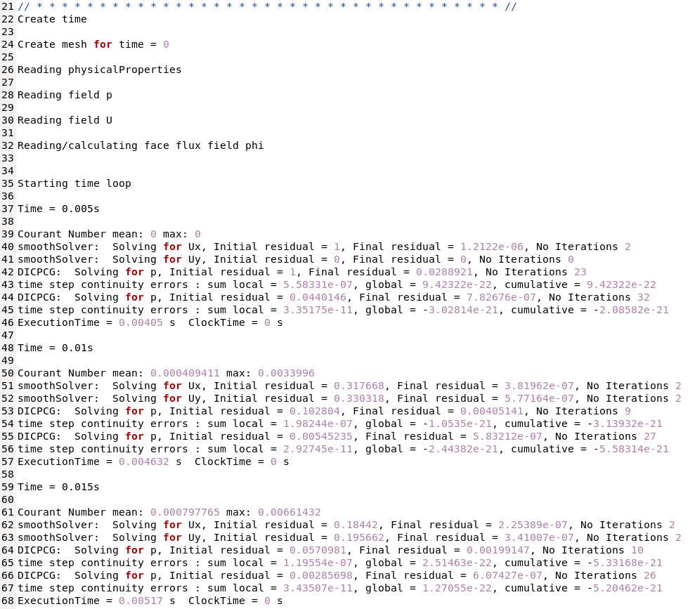
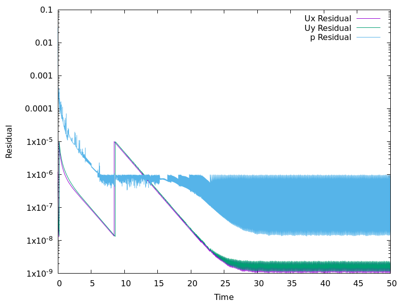
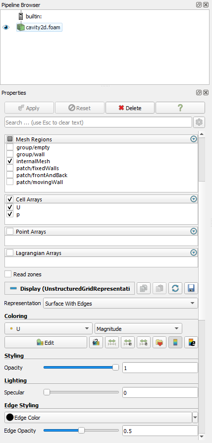
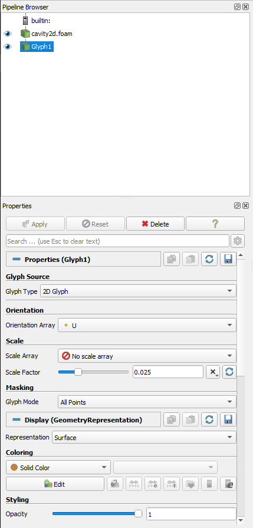
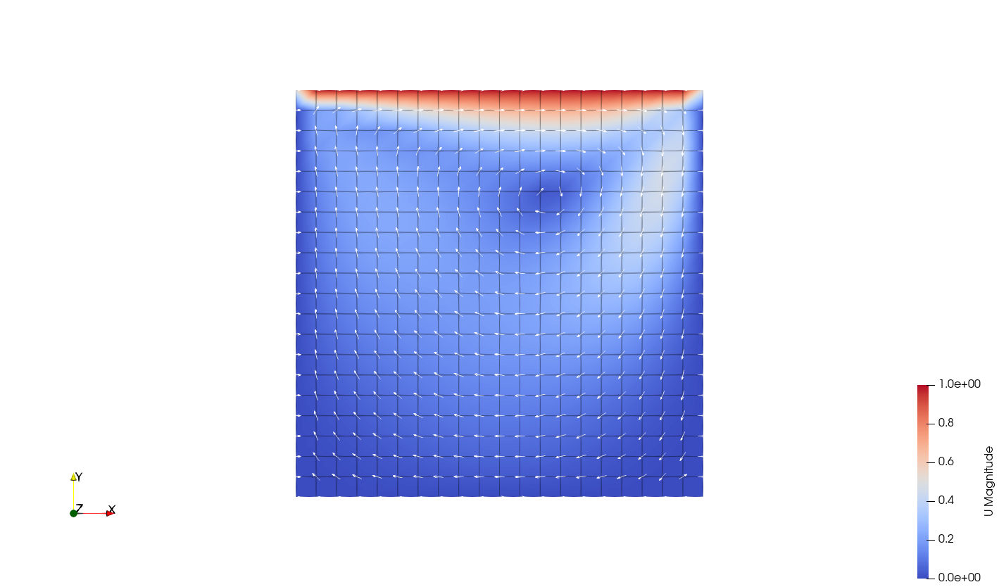
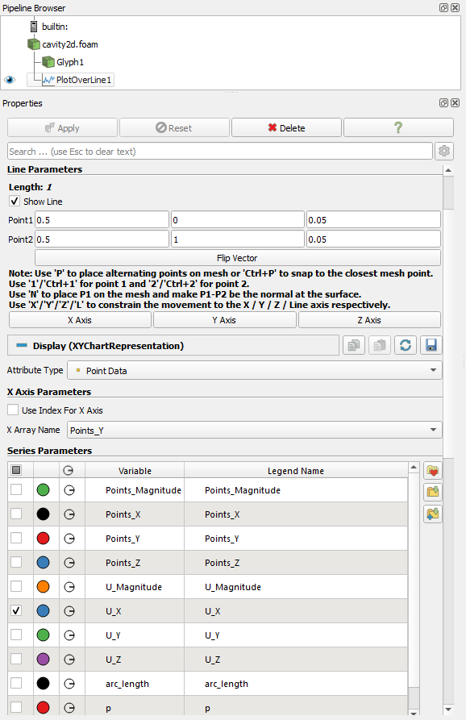
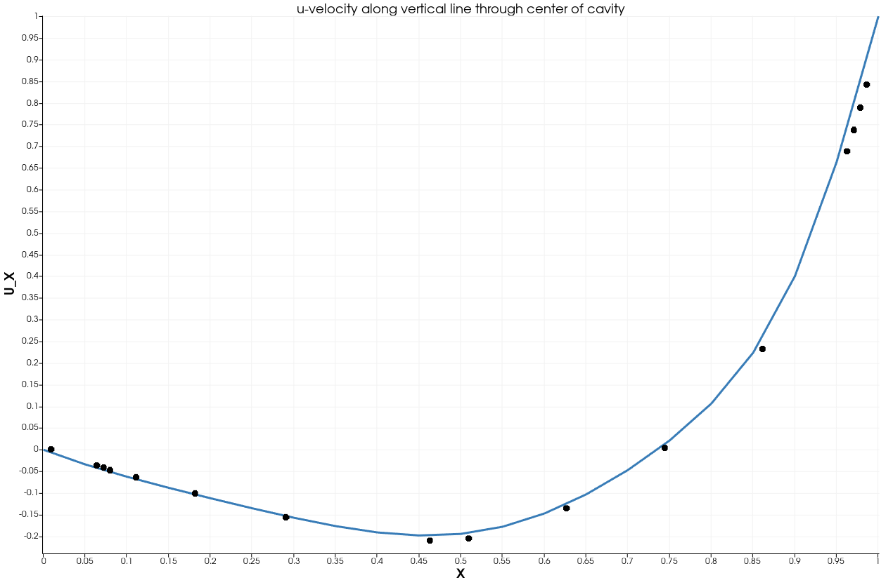

# Tutorial 1.3 - Running the Lid-Driven Cavity Simulation in OpenFOAM

##  Table of Contents
- [Tutorial 1.3 - Running the Lid-Driven Cavity Simulation in OpenFOAM](#tutorial-13---running-the-lid-driven-cavity-simulation-in-openfoam)
  - [Table of Contents](#table-of-contents)
  - [Introduction](#introduction)
  - [Running the Simulation](#running-the-simulation)
  - [Monitoring the Simulation](#monitoring-the-simulation)
    - [Residuals](#residuals)
    - [Iterations](#iterations)
    - [Continuity](#continuity)
  - [Visualizing Results](#visualizing-results)
    - [Visualizing the results in ParaView](#visualizing-the-results-in-paraview)
  - [Comparing simulation results to benchmark data](#comparing-simulation-results-to-benchmark-data)
    - [Procedure for Comparison:](#procedure-for-comparison)
  - [Exploratory exercises](#exploratory-exercises)
  - [References](#references)

## Introduction
In this part of the tutorial, you will run the LDC simulation set up in [Tutorial 1.2](../Tutorial_1_2/README.md). You will also learn how to monitor the simulation progress and understand the computational processes involved. Finally, we will discuss post-processing techniques to visualize and analyze the results.

## Running the Simulation
To start the simulation, follow these steps:

1. Navigate to your case directory:
   ```bash
   cd $FOAM_RUN/cavity2d
   ```

2. Execute the mesh generation utility `blockMesh`:
   ```bash
   blockMesh
   ```
   This command generates the computational mesh based on the 'blockMeshDict' file in the system directory. You should see output indicating the successful creation of the mesh.

3. Verify the quality of the generated mesh using the `checkMesh` utility. 
   ```bash
   checkMesh
   ```
   The utility performs various checks on the mesh, including:
   - Geometry checks (e.g., checking for non-orthogonality, skewness, and aspect ratio of cells).
   - Topology checks (e.g., ensuring connectivity and boundary definitions).
   - Additional quality checks (e.g., checking for non-positive volumes)
    
   Review the output to ensure that there are no critical errors. Warnings or errors related to mesh quality should be addressed before proceeding with the simulation.

4. Run the simulation and save the solver output to a log file for easier analysis:
   ```bash
   icoFoam > log &
   ```
   ```bash
   tail -f log
   ```
   The `tail -f` command allows you to view the log file in real-time. To exit `tail -f`, press <kbd>Ctrl+C</kbd>.

   The simulation will start, and you will see a series of messages in the terminal as the solver progresses through each time step.

   You will see the following:

   

   Alternatively, you can run the solver without saving a log file:
   ```bash
   icoFoam
   ```

5. Clean the case directory (if needed) using the `foamCleanCase` utility. This utility removes files from previous simulations, ensuring a fresh start:
   ```bash
   foamCleanCase
   ```

## Monitoring the Simulation

During the simulation run, it is essential to monitor the progress to ensure everything is functioning correctly. Key aspects to monitor include residuals, iterations, and continuity errors. These metrics provide insights into the convergence and stability of the simulation.

Generate the log files using `foamLog`:

```bash
foamLog log
```

This command processes the log file and generates a directory named "logs" containing files for each quantity's residuals and other metrics.

### Residuals

Monitoring residuals helps ensure that the solution is converging correctly. Residuals are typically reported as initial residuals (before the start of an iteration) and final residuals (after the iteration).

To visualize the residuals, you can use `gnuplot`:
1. Create a gnuplot script named "plot_residuals.gp":
   ```bash
   gedit plot_residuals.gp
   ```
2. Copy and paste the following content into the script file:
   ```c
   set terminal pngcairo size 800,600 enhanced font 'Verdana,12'
   set output 'residuals.png'

   set logscale y
   set xlabel "Time"
   set ylabel "Residual"

   plot "logs/UxFinalRes_0" using 1:2 with lines title 'Ux Residual', \
        "logs/UyFinalRes_0" using 1:2 with lines title 'Uy Residual', \
        "logs/pFinalRes_0" using 1:2 with lines title 'p Residual'
   ```
3. Save the file and exit.
4. Run the gnuplot script:
   ```bash
   gnuplot plot_residuals.gp
   ```
   This command will execute the script and generate a 'residuals.png' file with the plot of residuals vs. time.
5. Open the directory in Windows to view the generated plot:
   ```bash
   explorer.exe .
   ```
   This command will open the current directory in the `Windows File Explorer`, allowing you to easily locate and view the 'residuals.png' file.

   You will see the following:

   

   The residuals plot indicates a well-converged solution for the velocity field and the pressure field.

### Iterations

The number of iterations required to reach convergence within each time step can provide insights into the stability and efficiency of the solver. If the number of iterations is consistently high, it may indicate issues with solver settings or mesh quality.

To visualize the iterations, you can use `gnuplot`: 
1. Create a gnuplot script named 'plot_iterations.gp'.
2. Copy and paste the following content into the script file:
   ```c
   set terminal pngcairo size 800,600 enhanced font 'Verdana,12'
   set output 'iterations.png'

   set xlabel "Time"
   set ylabel "Iterations"

   plot "logs/UxIters_0" using 1:2 with lines title 'Ux Iterations', \
        "logs/UyIters_0" using 1:2 with lines title 'Uy Iterations', \
        "logs/pIters_0" using 1:2 with lines title 'p Iterations'
   ```
3. Save the file and exit.
4. Run the gnuplot script.

### Continuity

Continuity errors provide a measure of how well the solver is maintaining mass conservation throughout the simulation. It is crucial to monitor these errors to ensure that the mass conservation is not violated.

To visualize the continuity errors, you can use `gnuplot`:
1. Create a gnuplot script named 'plot_continuity.gp'.
2. Copy and paste the following content into the script file:
   ```c
   set terminal pngcairo size 800,600 enhanced font 'Verdana,12'
   set output 'continuity.png'

   set logscale y
   set xlabel "Time"
   set ylabel "Continuity Error"

   plot "logs/contGlobal_0" using 1:2 with lines title 'Global Continuity Error', \
        "logs/contLocal_0" using 1:2 with lines title 'Local Continuity Error'
   ```
3. Save the file and exit.
4. Run the gnuplot script.

By monitoring these key metrics, you can ensure the simulation is progressing correctly, identify any issues early, and validate the convergence and stability of your solution.

## Visualizing Results

After monitoring the simulation to ensure correct execution and convergence, the next step involves visualizing the results. This part of the tutorial will guide you through the process of generating visualizations using ParaView and comparing these results to the established benchmark data from [Ghia, Ghia, and Shin (1982)](https://www.sciencedirect.com/science/article/abs/pii/0021999182900584).

### Visualizing the results in ParaView

1. Preparing **ParaView** visualization:
   - Inside your working directory (where your case resides), create a new file:
     ```bash
     touch cavity2d.foam
     ```
     This file doesn’t require any content; its presence alone enables **ParaView** to recognize the case directory as containing **OpenFOAM** data.
   - Since **ParaView** is running on Windows, you need to transfer the simulation data from `wsl` to your Windows file system. Here’s how you can do it using the command line:
     ```bash
     cp -r $FOAM_RUN/cavity2d /mnt/c/Users/<YourUserName>/Downloads/
     ```
     Replace '\<YourUserName>' with your actual Windows username. This command copies the entire 'cavity2d' directory to your Windows 'Downloads' folder, making it accessible from Windows.
2. Opening the case in **ParaView**:
   - Open **ParaView** from your Windows start menu.
   - Go to 'File &rarr; Open', and navigate to the directory where you copied the 'cavity2d' folder.
   - Select the 'cavity2d.foam' file and click 'Open'. Then, click 'Apply' in the properties panel to load the simulation data.
3. Visualizing velocity magnitude and mesh edges:
   - After loading the 'cavity2d.foam' file in **ParaView**, locate the 'Color by' dropdown menu in the 'Properties' panel.
   - Select 'U' from the list, which represents the velocity field. Next to the 'U' selection, there is another dropdown where you can choose how the velocity is visualized. Select 'Magnitude' to view the scalar magnitude of the velocity vector field.
   - Over the 'Coloring' options you will find the 'Representation' dropdown menu. It is usually set to 'Surface' by default. Change the setting from 'Surface' to 'Surface With Edges'. This setting allows you to see both the scalar field represented on the surface and the edges of the mesh cells, providing a clear view of the mesh layout along with the flow visualization.
   - To further enhance the visualization, adjust the color of the edges in the 'Edge Color' dropdown menu, located under the 'Coloring' options, and choose 'black' color and '0.5' opacity.
    
     
4. Applying and adjusting the Glyphs:
   - With the 'cavity2d.foam' case loaded and 'U' (Magnitude) already activated, go to the toolbar and click on the Glyph button. 

     
   - In the Glyph properties panel, which appears after selecting the tool:
     -  Choose '2D Glyph' type.
     -  Orientation to 'U'.
     -  No scale array and a scale factor of 0.025.
     -  No masking ('Mode - All Points').
     -  Surface representation.
     -  Solid color - white.
  
       
5. Navigating to the last time step:
   - At the top of the **ParaView** window, locate the animation control toolbar. This includes play, pause, stop, and step buttons, along with a slider for time steps.
   - Jump to the last time step.
   
Here is what you should see if everything was done correctly:


## Comparing simulation results to benchmark data

After completing the simulation and visualizing the results in **ParaView**, the next step is to compare these results to established benchmark data. This comparison is essential for validating the accuracy of the simulation and ensuring that **OpenFOAM** provides reliable results for this classic CFD problem.

The benchmark data we are using for comparison comes from the study by [Ghia, Ghia, and Shin (1982)](https://www.sciencedirect.com/science/article/abs/pii/0021999182900584), which is a well-regarded source in the CFD community for LDC flow at various Reynolds numbers. This study provides detailed velocity profiles, which serve as a standard for validating numerical methods and computational tools.

### Procedure for Comparison:

1. Extract data in **ParaView**:
   - In the top menu bar in **ParaView**, navigate to 'Filters &rarr; Data Analysis &rarr; Plot Over Line'.
   - In the properties window that appears, set the 'Line Parameters' to extract the vertical center line from point (0.5, 0, 0.05) to point (0.5, 1, 0.05).
   - Scroll down to the 'X-Axis Parameters' and in the 'X Array Name' dropdown window, select 'Points_Y'.
   - In the 'Series Parameters' section, ensure that only 'U_x' is checked.

   The line plot will illustrate the velocity profile along the central vertical line.

   
   

2. Load benchmark data:
   - Load the benchmark data file [Re100_xcenter.csv](Re100_xcenter.csv) which contains the data for 'U_x' at the vertical center line in the cavity using 'File &rarr; Open'. 
   - Press 'Apply' in the properties window that pops up.
3. Compare data:
   - Close the table window that opens, and in the pipeline browser, click on the eyeball icon near the 'Re100_xcenter.csv' line to display it.
   - In the properties window for 'Re100_xcenter.csv', make the following adjustments:
     - Uncheck 'Use Index for X-Axis'.
     - Choose 'y' in the 'X Array Name' dropdown window.
     - Uncheck the variables 'x' and 'y' in the 'Series Parameters' section.
     - Click on the 'u' variable, and in the options for editing the visualization, set the line style to 'None' and choose a 'circle' marker with size '10'.
4. The resulting plot should show a comparison like this:

    

    The plot indicates an acceptable overlap between the simulation results and the benchmark data.

## Exploratory exercises

To deepen your understanding of fluid dynamics and simulation techniques, you are encouraged to explore various parameters and their effects on the LDC flow. These exercises are designed to help you grasp the sensitivity of the simulation results to changes in physical and numerical parameters and to extend your skills in setting up and modifying CFD cases in **OpenFOAM**.

1. Refining the mesh:
   - Objective: Observe how mesh refinement affects the accuracy and convergence of the solution.
   - Task: Simulate the cavity flow with different mesh sizes. Try grids of 10x10 and 50x50 cells.
   - Instructions:
     - Use the 'blockMeshDict' file to redefine the mesh. Change the blocks section to specify the number of cells in each direction.
     - Compare the results with those obtained from the 20x20 mesh to assess improvements or changes in the flow details and convergence characteristics.
2. Adjusting time steps:
   - Objective: Examine the impact of time step size on the simulation's stability and accuracy.
   - Task: Experiment with different time steps. Reduce to 0.001 and increase to 0.01.
   - Instructions:
     - Edit the 'deltaT' parameter in the 'controlDict' file.
     - Observe the effects on the simulation's convergence rate and the smoothness of the solution.
3. Varying Reynolds numbers:
   - Objective: Understand how the flow behavior changes with different Reynolds numbers.
   - Task: Run the simulation for different Reynolds numbers: 400, 1000, and 10000.
   - Instructions:
     - Modify the 'physicalProperties' file to adjust the kinematic viscosity corresponding to each Reynolds number.
     - Ensure other settings are consistent with the baseline case to isolate the effect of changes in Reynolds number.
     - Analyze how the flow transitions from laminar to potentially turbulent as Re increases.
4. Advanced challenge - clipped cavity case:
   - Objective: Develop skills in modifying and setting up more complex geometries and boundary conditions.
   - Task: Build and simulate the clipped cavity case as showcased in the **OpenFOAM** [documentation (2.1.9)](https://www.openfoam.com/documentation/tutorial-guide/2-incompressible-flow/2.1-lid-driven-cavity-flow).
   - Instructions:
     - Without following the specific tutorial, try to conceptualize and create a 'clipped' version of the standard lid-driven cavity. This means you will modify the geometry to include an obstruction or alteration that changes the flow dynamics.
     - Start by modifying the blockMeshDict to define your new geometry. 
     - Think about how clipping or altering a portion of the cavity might affect the flow and how you would like to explore these effects.
     - Adjust the boundary conditions and other simulation parameters in **OpenFOAM** to accommodate your new setup.
     - Run simulations to see how the clipped section influences the flow pattern compared to the unaltered cavity.

## References

[https://doc.cfd.direct/openfoam/user-guide-v11/contents](https://doc.cfd.direct/openfoam/user-guide-v11/contents)   
[https://www.openfoam.com/documentation/tutorial-guide/2-incompressible-flow/2.1-lid-driven-cavity-flow](https://www.openfoam.com/documentation/tutorial-guide/2-incompressible-flow/2.1-lid-driven-cavity-flow)
[http://www.wolfdynamics.com/images/begtuts/T1_cavity_revisited.pdf](http://www.wolfdynamics.com/images/begtuts/T1_cavity_revisited.pdf)   
[https://www.comsol.com/blogs/how-to-solve-a-classic-cfd-benchmark-the-lid-driven-cavity-problem](https://www.comsol.com/blogs/how-to-solve-a-classic-cfd-benchmark-the-lid-driven-cavity-problem)   
[https://www.cfd-online.com/Wiki/Lid-driven_cavity_problem](https://www.cfd-online.com/Wiki/Lid-driven_cavity_problem)   
[https://www.thevisualroom.com/27_openfoam_tutorials_opencfd/01_lid_driven_cavity/lid_driven_cavity.html](https://www.thevisualroom.com/27_openfoam_tutorials_opencfd/01_lid_driven_cavity/lid_driven_cavity.html)   