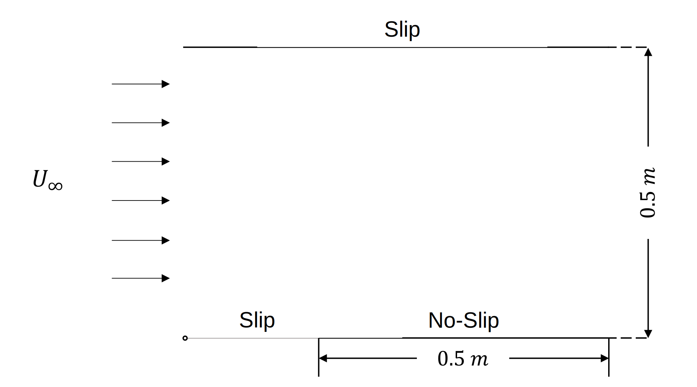

# Tutorial 2.1 – Introduction to boundary layer and Blasius Solution

##  Table of Contents
- [Tutorial 2.1 – Introduction to boundary layer and Blasius Solution](#tutorial-21--introduction-to-boundary-layer-and-blasius-solution)
  - [Table of Contents](#table-of-contents)
  - [Introduction](#introduction)
  - [Overview](#overview)
  - [Governing Equations](#governing-equations)
    - [Continuity Equation](#continuity-equation)
    - [Momentum Equations](#momentum-equations)
  - [Analytical Approach: Blasius Solution](#analytical-approach-blasius-solution)
    - [Derivation of the Blasius Equation](#derivation-of-the-blasius-equation)
    - [Blasius Correlations](#blasius-correlations)
  - [References](#references)

## Introduction

In the previous tutorial, we successfully set up `wsl` and **OpenFOAM** on your Windows system, gaining familiarity with the initial steps of using **OpenFOAM** for CFD. By now, you should be comfortable with setting up and running basic simulations, as well as visualizing the results using **ParaView**.

Building on these foundational skills, this tutorial delves into a more focused study of fluid dynamics by exploring laminar flow over a flat plate. This is a classic problem in fluid mechanics, pivotal for understanding boundary layer theory and its practical applications. We will configure and run a simulation to analyze the boundary layer development as fluid flows over the plate, and compare our results with the theoretical solution provided by the Blasius boundary layer equation. This will bridge theoretical knowledge with practical computational applications, enhancing both your understanding and analytical skills in fluid dynamics.

## Overview
The problem of laminar flow over a flat plate is fundamental in studying the physics of boundary layers, which are thin regions near a surface where fluid velocity changes from zero due to the no-slip condition to the free stream velocity at the edge of the boundary layer. This scenario is commonly used as a model to understand how fluid resistance and heat transfer occur on surfaces, making it applicable to diverse fields such as aerodynamics, heat exchangers, etc.

The experimental setup for studying laminar flow over a flat plate consists of a thin, horizontal plate positioned in a controlled airflow environment to simulate ideal boundary layer conditions. This setup is specifically designed to facilitate detailed observations and measurements of the boundary layer that forms as air passes over the plate. 

Here are the detailed geometric and flow conditions:
- The plate is 0.5 meters in length, which is sufficient to observe the full development of the boundary layer from its initiation at the leading edge to a fully developed state before any transition to turbulence might occur. The width of the plate is considered infinite for the purpose of this two-dimensional study, eliminating side effects and ensuring a purely two-dimensional flow over the surface.
- Air flows over the plate with a uniform velocity of $`U_\infty = 1.0 \frac{m}{s}`$. This moderate speed ensures that the flow remains laminar throughout the length of the plate, minimizing the chances of transition to turbulence, which could complicate the analysis. 
- The air properties are:
  - Density: $`\rho = 1.225 \frac{kg}{m^3}`$
  - Dynamic viscosity: $`\mu = 1.7894e^{-5} \frac{kg}{m \cdot s}`$
- At the leading edge of the plate (x = 0), the boundary layer thickness is theoretically zero as the flow begins to interact with the plate surface.
- The no-slip condition applies, meaning the velocity of the air directly contacting the plate is zero (u = 0 at y = 0). This is a fundamental condition for the development of the boundary layer.
- At a height sufficiently far from the surface, the velocity of the air matches the free stream velocity ($`U_\infty`$), indicating that the effects of the plate on the airflow have diminished.
- The setup assumes symmetry along the centerline of the plate to focus solely on the flow dynamics above the plate, without interference from edges or three-dimensional effects. This assumption simplifies the analysis and is typical in theoretical studies to isolate the effects of boundary layer development.

Here is a schematic of the problem:



## Governing Equations
Under the assumptions of steady, two-dimensional, and incompressible flow with no pressure gradient, the governing Navier-Stokes equations simplify significantly:

### Continuity Equation

```math
\frac{\partial u}{\partial x} + \frac{\partial v}{\partial y} = 0 
``` 

### Momentum Equations

```math
u \frac{\partial u}{\partial x} + v \frac{\partial v}{\partial y} = \nu \frac{\partial^2 u}{\partial y^2} 
``` 

## Analytical Approach: Blasius Solution
The theoretical approach to solving this problem involves utilizing the Blasius boundary layer theory. The Blasius solution is an analytical solution to the boundary layer equations for steady, two-dimensional, incompressible flow over a flat plate without a pressure gradient. Developed by Heinrich Blasius in the early 20th century, this solution uses a similarity transformation to reduce the Navier-Stokes equations to a single third-order ODE, providing a fundamental understanding of boundary layer development.

### Derivation of the Blasius Equation
The Blasius solution begins by introducing a similarity variable $`\eta`$, which combines the spatial coordinates into a single non-dimensional parameter, and a stream function $`\Psi`$, which ensures the satisfaction of the continuity equation. The similarity variable is defined as:

```math
\eta = y \sqrt{\frac{U_\infty}{\nu x}}
``` 

where $`y`$ is the normal distance from the plate, $`U_\infty`$ is the free stream velocity, $`\nu`$ is the kinematic viscosity, and $`x`$ is the distance along the plate from the leading edge.

The stream function $`\Psi`$ is related to the velocity components as:

```math
u = \frac{\partial \Psi}{\partial y}, \quad v = -\frac{\partial \Psi}{\partial x}
``` 

Using $`\Psi`$, the Blasius solution involves transforming the boundary layer equations to a single third-order ODE:

```math
2f''' + ff'' = 0
``` 

where $`f`$ is a dimensionless function of $`\eta`$ defined from the stream function.

The boundary conditions for this equation are:

```math
f(0) = 0, \quad f'(0) = 0, \quad f'(\infty) = 1
``` 

These conditions represent the no-slip condition at the wall, the no penetration condition, and the match with the free stream velocity, respectively.

### Blasius Correlations

The thickness of the boundary layer, where the velocity reaches 99% of the free stream velocity, is approximated as:

```math
\delta = 5.0 \sqrt{\frac{\nu x}{U_\infty}}
```

This relationship shows the growth of boundary layer thickness as a function of distance from the leading edge under laminar flow conditions.

The skin friction coefficient, which quantifies shear stress at the wall relative to the dynamic pressure in the flow, is given as:

```math
C_f = \frac{\tau_w}{\frac{1}{2} \rho_\infty U_\infty^2 } = \frac{0.664}{\sqrt{Re_x}}
```

where $`\tau_w = \mu \frac{\partial u}{\partial y} |_{y=0}`$ is the wall shear stress and $`Re_x`$ is the Reynolds number based on the distance $`x`$ from the leading edge. This formula indicates how the shear stress decreases as the boundary layer develops.

For the entire plate, the overall drag coefficient, integrating the skin friction over the plate’s surface, is computed by:

```math
C_D = \frac{1}{L} \int_{0}^{L} C_f \,dx \ = \frac{1.328}{\sqrt{Re_L}}
```

where $`Re_L`$ is the Reynolds number based on the total length $`L`$ of the plate.


We are now well-prepared to apply these theoretical concepts in a practical setting.

## References
[https://courses.ansys.com/wp-content/uploads/2020/08/Lesson4-Flat-Plate-Blasius-Solution-Handout.pdf](https://courses.ansys.com/wp-content/uploads/2020/08/Lesson4-Flat-Plate-Blasius-Solution-Handout.pdf)   

[https://ahaghighi.profile.semnan.ac.ir/downloads/file/452](https://ahaghighi.profile.semnan.ac.ir/downloads/file/452)