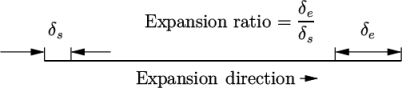
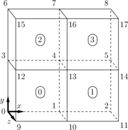

# Tutorial 2.2 – OpenFOAM Setup

##  Table of Contents
- [Tutorial 2.2 – OpenFOAM Setup](#tutorial-22--openfoam-setup)
  - [Table of Contents](#table-of-contents)
  - [Introduction](#introduction)
  - [Transition to OpenFOAM version 11](#transition-to-openfoam-version-11)
  - [Getting Started](#getting-started)
  - [Modifying Boundary Conditions](#modifying-boundary-conditions)
  - [Modify the Physical Properties](#modify-the-physical-properties)
  - [Mesh setup](#mesh-setup)
    - [Understanding simpleGrading](#understanding-simplegrading)
    - [Mesh Refinement Strategy](#mesh-refinement-strategy)
  - [Editing the controlDict File](#editing-the-controldict-file)
  - [Note on fvScheme and fvSolution](#note-on-fvscheme-and-fvsolution)
  - [References](#references)

## Introduction
The goal of this tutorial is to guide you through the setup and simulation of laminar flow over a flat plate using **OpenFOAM**. This hands-on exercise will deepen your understanding of boundary layer development. By the end, you will be able to visualize and analyze the flow characteristics, reinforcing your theoretical knowledge through computational practice.

## Transition to OpenFOAM version 11
We will be using **OpenFOAM** version 11. This version introduces several updates and improvements, including changes to solvers and utilities. Specifically, we will use 'foamRun' ([documentation](https://doc.cfd.direct/openfoam/user-guide-v11/running-applications)), a utility that handles running simulations by specifying the solver type in the 'controlDict' file.

## Getting Started

Begin by copying the cavity tutorial directory provided with **OpenFOAM** and renaming it to "laminar_flatplate". Open a terminal and execute the following commands:

```bash
cd $FOAM_RUN
```

```bash
mkdir laminar_flatplate
```

```bash
cp -r $FOAM_TUTORIALS/incompressibleFluid/cavity/* laminar_flatplate/
```

```bash
cd laminar_flatplate
```

In the copied 'laminar_flatplate' directory, there are several files that are not relevant for our laminar flow simulation. Remove these unnecessary files to avoid confusion:

```bash
rm -rf 0/epsilon 0/k 0/nut 0/nuTilda 0/omega
```

## Modifying Boundary Conditions

Next, we need to define the boundary conditions for the flat plate simulation. We will set up an inlet, outlet, and specify the wall boundaries. An inlet boundary is needed to specify the flow entering the domain, and an outlet boundary is needed to allow the flow to exit the domain. A slip condition is defined at the top to avoid wall effects, simulating an unbounded flow. Initially, a slip condition is defined near the inlet to prevent edge effects, and the no-slip wall is defined further downstream to represent the physical plate where boundary layer development occurs. An empty boundary condition is set for the front and back faces, indicating a two-dimensional simulation.

Edit the '0/U' file to define the velocity boundary conditions, and change the internal field to (1 0 0) for faster initialization and convergence of the solution:

```bash
gedit 0/U
```

```cpp
internalField   uniform (1 0 0);

boundaryField
{
    inlet
    {
        type            freestreamVelocity;
        freestreamValue $internalField;
    }
    
    outlet
    {
        type        inletOutlet;
        phi         phi;
        inletValue  uniform (0 0 0);
        value       $internalField;
    }

    top
    {
        type            slip;
    }

    bottom
    {
        type            noSlip;
    }

    bottomslip
    {
        type            slip;
    }

    frontAndBack
    {
        type            empty;
    }
}
```

At the inlet, we use the 'freestreamVelocity' condition to specify the uniform flow entering the domain. This condition helps to maintain a consistent velocity profile and avoid disturbances. At the outlet, we use the 'inletOutlet' condition to handle outflow while allowing for potential inflow if the flow reverses. This ensures that the outlet boundary can adapt to varying flow conditions. The 'phi' indicates the flux field used to determine the direction of flow, 'inletValue' is the value applied if the boundary switches to an inlet (typically zero for no inflow), and 'value' is the initial condition for the velocity at the outlet. This is set to uniform (1 0 0) to match the freestream velocity, ensuring consistency in flow direction.

For the pressure field, we will use the 'freestreamPressure' condition for both the inlet and outlet to maintain consistent pressure levels and stabilize flow. A 'zeroGradient' condition is used for the no-slip wall to ensure no normal pressure gradient at the wall, while a similar condition is applied for the slip wall since there is no normal pressure gradient expected.

Here is the setup for the '0/p' file:

```bash
gedit 0/p
```

```cpp
internalField   uniform 0;

boundaryField
{
    inlet
    {
        type            freestreamPressure;
        freestreamValue $internalField;
    }

    outlet
    {
        type            freestreamPressure;
        freestreamValue $internalField;
    }

    top
    {
        type            zeroGradient;
    }

    bottom
    {
        type            zeroGradient;
    }

    bottomslip
    {
        type            zeroGradient;
    }
    
    frontAndBack
    {
        type            empty;
    }
}
```

## Modify the Physical Properties

Change the kinematic viscosity ($`\nu`$) to match the desired laminar flow conditions. Edit the 'constant/physicalProperties' file:

```cpp
nu              [0 2 -1 0 0 0 0] 1.460735e-5;
```

Specify the simulation type as 'laminar' in the 'constant/momentumTransport' file:

```cpp
simulationType  laminar;
```

Make sure to remove all lines related to Reynolds-Averaged Navier-Stokes (RAS) models from the 'constant/momentumTransport' file, as these are not needed for laminar flow simulations.

## Mesh setup

To accurately capture the boundary layer development over the flat plate, the mesh must be fine enough near the wall where the gradients are highest. However, using a uniformly fine mesh throughout the entire domain is impractical due to computational constraints. Instead, we employ a non-uniform mesh using 'simpleGrading' to refine the mesh where necessary while keeping it coarser elsewhere.

### Understanding simpleGrading
The simpleGrading method is used in **OpenFOAM**'s `blockMesh` utility to specify non-uniform cell sizes within a block. It allows for mesh refinement in specified directions. The grading is defined by a ratio that specifies how cell sizes change from one side of the block to the other. 

From the **OpenFOAM** [user guide](https://doc.cfd.direct/openfoam/user-guide-v11/blockmesh):
A 'simpleGrading' entry has the form (gx gy gz), where 'gx' is the grading in the x-direction, 'gy' is the grading in the y-direction, 'gz' is the grading in the z-direction. A grading value greater than one means cells will get progressively larger. A grading value less than one means cells will get progressively smaller. A grading value of one means uniform cell sizes.

<figure>

<figcaption>

Figure: Mesh grading along a block edge [doc.cfd.direct](https://doc.cfd.direct/openfoam/user-guide-v11/blockmesh).

</figcaption>
</figure>

### Mesh Refinement Strategy

We will define four blocks to achieve the necessary mesh refinement: 
- Refinement near the no-slip wall: To resolve the boundary layer, we need a fine mesh close to the flat plate (no-slip wall).
- Refinement in the vertical direction: To transition smoothly from the fine mesh near the wall to a coarser mesh farther away, vertical grading is applied.

Below is an illustration of the block structure and vertex numbering used in the mesh setup.

<figure>

<figcaption>

Figure: Block structure [openfoam.com](https://www.openfoam.com/documentation/tutorial-guide/2-incompressible-flow/2.1-lid-driven-cavity-flow).

</figcaption>
</figure>

The ordering of the vertices for block creation follows the right-hand rule, which ensures the correct orientation of the blocks.

Here is the setup for the mesh using blockMeshDict:

```cpp
convertToMeters 1.0;

vertices
(
    (-0.1 0.0 0.0)  //0
    ( 0.0 0.0 0.0)  //1
    ( 0.5 0.0 0.0)  //2
    (-0.1 0.1 0.0)  //3
    ( 0.0 0.1 0.0)  //4
    ( 0.5 0.1 0.0)  //5
    (-0.1 0.5 0.0)  //6
    ( 0.0 0.5 0.0)  //7
    ( 0.5 0.5 0.0)  //8

    (-0.1 0.0 0.1)  //9
    ( 0.0 0.0 0.1)  //10
    ( 0.5 0.0 0.1)  //11
    (-0.1 0.1 0.1)  //12
    ( 0.0 0.1 0.1)  //13
    ( 0.5 0.1 0.1)  //14
    (-0.1 0.5 0.1)  //15
    ( 0.0 0.5 0.1)  //16
    ( 0.5 0.5 0.1)  //17
);

blocks
(
    hex (0 1 4 3 9  10 13 12) (20 80 1) simpleGrading (1   50 1) // bottom: inlet --> slip
    hex (1 2 5 4 10 11 14 13) (60 80 1) simpleGrading (2.5 50 1) // bottom: noslip -> outlet

    hex (3 4 7 6 12 13 16 15) (20 20 1) simpleGrading (1   10 1) // top:    inlet -> slip
    hex (4 5 8 7 13 14 17 16) (60 20 1) simpleGrading (2.5 10 1) // top:    slip --> outlet 
);

boundary
(
    inlet
    {
        type patch;
        faces
        (
            (0 9 12 3)
            (3 12 15 6)
        );
    }
    outlet
    {
        type patch;
        faces
        (
            (2 5 14 11)
            (5 8 17 14)
        );
    }
    top
    {
        type wall;
        faces
        (
            (6 15 16 7)
            (7 16 17 8)
        );
    }
    bottom
    {
        type wall;
        faces
        (
            (1 2 11 10)
        );
    }
    bottomslip
    {
        type wall;
        faces
        (
            (0 1 10 9)
        );
    }
    frontAndBack
    {
        type empty;
        faces
        (            
            (0 3 4 1)
	        (1 4 5 2)
            (3 6 7 4)
	        (4 7 8 5)
            (9 10 13 12)
	        (10 11 14 13)
	        (12 13 16 15)
 	        (13 14 17 16)
        );
    }
);

mergePatchPairs
(
);
```

In this example, the first block (0 1 4 3 9 10 13 12) refines the mesh near the inlet and the slip wall with a grading ratio of '1' in the x-direction and '50' in the y-direction to ensure finer cells near the wall and gradually larger cells away from the wall. The second block (1 2 5 4 10 11 14 13) refines the mesh near the no-slip wall and transitions to the outlet with similar grading. The third and fourth blocks handle the upper part of the domain, transitioning smoothly to a coarser mesh farther away from the wall. 

By following this mesh setup, we ensure that the boundary layer is accurately captured while maintaining a manageable number of cells in the overall domain. This setup balances computational efficiency with the need for precision in resolving the flow near the flat plate.

At the transition point from slip to no-slip, a finer mesh is advised to capture the gradients accurately. However, in `blockMesh`, grading over the x-direction can be more complicated and a source of error. For advanced meshes, refer to examples such as the one in [SU2](https://su2code.github.io/tutorials/Laminar_Flat_Plate/) or [Ansys](https://ansys13.ansys.com/AnsysInnovationCourses/FBU/AIC2-RealViscousFlows/Course%201%20-%20Laminar%20Boundary%20Layer%20Theory/Simulation%20Example%20-%20Laminar%20Flow%20Over%20Flat%20Plate/LaminarFlowOverFlatPlate-SimulationFiles.zip).

<figure>

<figcaption>

Figure: Mesh from [SU2](https://www.openfoam.com/documentation/tutorial-guide/2-incompressible-flow/2.1-lid-driven-cavity-flow).

</figcaption>
</figure>

## Editing the controlDict File

Change the following lines in the 'controlDict' file:

```cpp
writeControl    runTime;

writeInterval   1;
```

## Note on fvScheme and fvSolution

For now, we will not be diving into 'fvScheme' and 'fvSolution' as there is already plenty of material to cover and learn. These topics, while important, will be reserved for later when we have a solid understanding of the fundamentals.

## References
[https://su2code.github.io/tutorials/Laminar_Flat_Plate/](https://su2code.github.io/tutorials/Laminar_Flat_Plate/)   

[https://openfoamwiki.net/index.php/Blasius_Flat-Plate_Flow_Benchmark](https://openfoamwiki.net/index.php/Blasius_Flat-Plate_Flow_Benchmark)

[https://cfdmonkey.com/verification-of-flow-over-a-flat-plate-in-openfoam/](https://cfdmonkey.com/verification-of-flow-over-a-flat-plate-in-openfoam/)