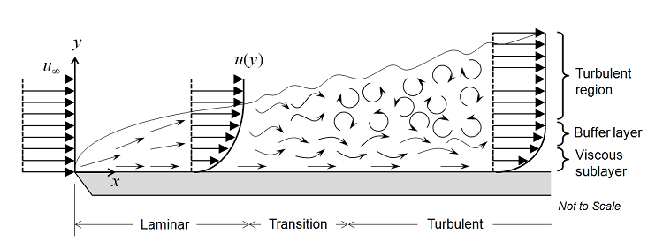

# Tutorial 3.1 – Turbulent flow and turbulence models

##  Table of Contents
- [Tutorial 3.1 – Turbulent flow and turbulence models](#tutorial-31--turbulent-flow-and-turbulence-models)
  - [Table of Contents](#table-of-contents)
  - [Introduction](#introduction)
  - [Overview](#overview)
  - [Structure of the Turbulent Boundary Layer](#structure-of-the-turbulent-boundary-layer)
  - [Governing Equations](#governing-equations)
  - [Turbulence Models](#turbulence-models)
    - [k-epsilon model](#k-epsilon-model)
    - [k-omega model](#k-omega-model)
    - [Shear Stress Transport (SST) Model](#shear-stress-transport-sst-model)
  - [Law-of-the-Wall](#law-of-the-wall)
    - [Non-Dimensionalization of y and u](#non-dimensionalization-of-y-and-u)
    - [Regions of the Near-Wall Turbulent Flow](#regions-of-the-near-wall-turbulent-flow)
  - [References](#references)


## Introduction

In this tutorial, we will explore the dynamics of turbulent flow over a flat plate. Building on the principles of laminar flow discussed in previous tutorials, we will delve into the intricacies of turbulence, which is a common phenomenon in many engineering applications such as aerospace, automotive, and environmental engineering. Turbulence, characterized by chaotic and stochastic property changes in fluid flow, is a complex phenomenon but can be analyzed using various models. We will particularly focus on the k-epsilon (k-$`\epsilon`$) and k-omega (k-$`\omega`$) turbulence models, which are widely used in CFD for their robustness and accuracy. Additionally, we will discuss the law-of-the-wall, a fundamental concept in turbulence modeling near walls.

## Overview

Turbulent flow over a flat plate is a fundamental problem in fluid mechanics and serves as a critical test case for validating turbulence models in CFD. As fluid flows over the flat wall, it initially forms a laminar boundary layer at the leading edge. This laminar flow is characterized by smooth, orderly layers of fluid. However, as the flow moves downstream and the Reynolds number increases, disturbances grow, leading to a transition to turbulence. This transition is marked by the development of chaotic oscillations and vortices within the boundary layer, significantly altering the flow characteristics. The study of this flow involves understanding the structure of the turbulent boundary layer and the transition from laminar to turbulent flow.

## Structure of the Turbulent Boundary Layer

The turbulent boundary layer can be divided into several distinct regions:
- Viscous Sublayer: The region closest to the wall where viscous forces dominate. Here, the velocity increases linearly with distance from the wall.
- Buffer Layer: A thin transition zone where both viscous and turbulent forces are significant.
- Log-Law Region: Further from the wall, where the velocity profile follows a logarithmic distribution.
- Free-Stream Region: The outer region where the flow is unaffected by the wall and fully turbulent.

Understanding these regions is crucial for accurate turbulence modeling, especially near the wall where the flow behavior is complex and highly variable.

<figure>

<figcaption>

Figure: Flow of a fluid over a flat plate [comsol.com](https://www.comsol.com/blogs/which-turbulence-model-should-choose-cfd-application).
</figcaption>
</figure>

## Governing Equations

To model turbulent flow, we use the Reynolds-Averaged Navier-Stokes (RANS) equations, which decompose the instantaneous flow variables $`u`$ into mean $`\overline{u}`$ and fluctuating components $`u'`$ and average the equations over time:

```math
u = \overline{u} + u' 
``` 

To derive the RANS equations, we start by substituting the decomposed variables into the Navier-Stokes equations and then applying a time-averaging operation. The resulting incompressible RANS equations are:

```math
\frac{\partial \overline{u_i}}{\partial x_i} = 0 
``` 

```math
\frac{\partial \overline{u_i}}{\partial t} + \overline{u_j} \frac{\partial \overline{u_i}}{\partial x_j} = - \frac{1}{\rho} \frac{\partial \overline{p}}{\partial x_i} + \nu \frac{\partial^2 \overline{u_i}}{\partial {x_j}^2} - \frac{\partial \overline{u'_i u'_j}}{\partial {x_j}} 
``` 

where $`\overline{u_i}`$ and $`\overline{p}`$ are the mean velocity and pressure.

The averaging process introduces additional terms known as Reynolds stresses $`\overline{u'_i u'_j}`$, which represent the effects of the turbulent fluctuations on the mean flow. To close the equations, these unknowns most be modeled. 

To learn more, check out this YouTube video on modeling the Reynolds stresses - [link](https://youtu.be/SVYXNICeNWA?si=9kUMxpxUMvcFgjvf).

## Turbulence Models

Turbulence models are essential for simulating turbulent flows because they allow us to approximate the effects of turbulence without resolving every small eddy and fluctuation, which would be computationally prohibitive. Various turbulence models have been developed to close the RANS equations by providing expressions for the Reynolds stresses. Among these models, the k-$`\epsilon`$ and k-$`\omega`$ models are the most commonly used.

### k-epsilon model

The k-$`\epsilon`$ model solves two transport equations for the turbulent kinetic energy ($`k`$) and its dissipation rate ($`\epsilon`$). It is robust, computationally efficient, and widely used in industrial applications due to its simplicity and reasonable accuracy for many flows. However, it assumes isotropy of turbulence, which makes it less accurate in flows with strong directional influences, strong pressure gradients or complex geometries.

The turbulent kinetic energy is given as:

```math
k = \frac{1}{2}(u'^2 + v'^2 + w'^2)
``` 

where $`u'`$, $`v'`$, and $`w'`$ are the fluctiating parts of the velocity components in the $`x`$, $`y`$, and $`z`$ directions, respectively.

As part of the k-$`\epsilon`$ model, $`k`$ and $`\epsilon`$ are solved from their appropriate governing equations:

- Transport equation for $`k`$:

```math
\frac{\partial k}{\partial t} + \overline{u_j} \frac{\partial k}{\partial x_j} = P_k - \epsilon + \frac{\partial}{\partial x_j} \left( \left( \nu + \frac{\nu_t}{\sigma_k} \right) \frac{\partial k}{\partial x_j} \right) 
```

- Transport equation for $`\epsilon`$:

```math
\frac{\partial \epsilon}{\partial t} + \overline{u_j} \frac{\partial \epsilon}{\partial x_j} = C_{\epsilon1} \frac{\epsilon}{k} P_k - C_{\epsilon2} \frac{\epsilon^2}{k} + \frac{\partial}{\partial x_j} \left( \left( \nu + \frac{\nu_t}{\sigma_\epsilon} \right) \frac{\partial \epsilon}{\partial x_j} \right) 
```

  where $`P_k`$ is the production of turbulent kinetic energy, $`\nu`$ is the kinematic viscosity, $`\nu_t`$ is the turbulent viscosity, and $`C_{\epsilon1}`$, $`C_{\epsilon2}`$, $`\sigma_k`$, and $`\sigma_\epsilon`$ are empirical constants.

The turbulent viscosity $`\mu_t`$ is related to the turbulent kinetic energy and dissipation rate by:

```math
\mu_t = C_\mu \frac{k^2}{\epsilon} 
```

where $`C_\mu`$ is a constant derived from empirical data, usually taken as 0.09. This relationship helps in closing the equations and calculating the Reynolds stresses, thus allowing for the effective simulation of turbulent flows using the k-$`\epsilon`$ model. 

For more details, you can watch this [video lecture on the k-$`\epsilon`$ model](https://youtu.be/fOB91zQ7HJU?si=S-exGIPN52-h7Cpr).

### k-omega model

The k-$`\omega`$ model solves for the turbulent kinetic energy ($`k`$) and the specific dissipation rate ($`\omega`$). This model is better suited for near-wall treatments and flows with adverse pressure gradients. It provides more accurate predictions in the boundary layer regions where the flow interacts with surfaces. However, it is more sensitive to initial and boundary conditions compared to the k-$`\epsilon`$ model.

As part of the k-$`\omega`$ model, $`k`$ and $`\omega`$ are solved from their appropriate governing equations:

- Transport equation for $`k`$:

```math 
\frac{\partial k}{\partial t} + \overline{u_j} \frac{\partial k}{\partial x_j} = P_k - \beta^* k \omega + \frac{\partial}{\partial x_j} \left( \left( \nu + \frac{\nu_t}{\sigma_k} \right) \frac{\partial k}{\partial x_j} \right) 
  ```

- Transport Equation for $`\omega`$:

```math
\frac{\partial \omega}{\partial t} + \overline{u_j} \frac{\partial \omega}{\partial x_j} = \frac{\alpha}{\nu_t} P_k - \beta \omega^2 + \frac{\partial}{\partial x_j} \left( \left( \nu + \frac{\nu_t}{\sigma_\omega} \right) \frac{\partial \omega}{\partial x_j} \right) 
```

  where $`P_k`$ is the production of turbulent kinetic energy, $`\nu`$ is the kinematic viscosity, $`\nu_t`$ is the turbulent viscosity, and $`\alpha`$, $`\beta`$, $`\beta^*`$, $`\sigma_k`$, and $`\sigma_\omega`$ are empirical constants.

The turbulent viscosity $`\mu_t`$ is related to the turbulent kinetic energy and specific dissipation rate by:

```math
\mu_t = \frac{k}{\omega} 
```

This relationship helps in closing the equations and calculating the Reynolds stresses, thus allowing for the effective simulation of turbulent flows using the k-$`\omega`$ model. 

For additional information, please refer to this [video lecture on the k-\(\omega\) model](https://youtu.be/26QaCK6wDp8?si=CpQEBDBLRVPASvdU).

### Shear Stress Transport (SST) Model

The k-$`\omega`$ SST model is a hybrid model that combines the strengths of both the k-$`\epsilon`$ and k-$`\omega`$ models. It uses the k-$`\omega`$ formulation in the near-wall region, where it provides accurate boundary layer predictions, and transitions to the k-$`\epsilon`$ formulation in the free stream, where it avoids sensitivity issues. The SST model improves accuracy in predicting flow separation and handling complex boundary layers, making it a popular choice for a wide range of engineering applications.

For more details, you can watch this [video on the k-$`\omega`$ $`SST`$ model](https://youtu.be/myv-ityFnS4?si=s4CX4Ng4dvpJDfyS).

## Law-of-the-Wall

In previous tutorials, we fully resolved the boundary layer in laminar flow cases, enforcing a no-slip condition at the wall. This approach ensures high accuracy but requires fine mesh resolution near the wall to capture the steep velocity gradients, making it computationally expensive. In turbulent flows or large domains, resolving all the scales of turbulence near the wall would be prohibitively expensive. The law-of-the-wall offers a solution by using empirical relationships to model the near-wall region, significantly reducing computational requirements while maintaining acceptable accuracy. This method allows for the use of coarser meshes away from the wall, optimizing computational resources.

The law-of-the-wall is a fascinating phenomenon in turbulence. It describes how the velocity profile near a wall in a turbulent flow is similar across a wide range of turbulent flows, regardless of the specific conditions. This universality makes it a powerful tool in turbulence modeling.

### Non-Dimensionalization of y and u

Before diving into the equations of the law-of-the-wall, it is essential to understand the non-dimensionalization of the distance from the wall ($`y`$) and the velocity ($`u`$):

Non-Dimensional distance $`y^+`$

```math
y^+ = \frac{yu_\tau}{\nu}
```

where:
- $`y`$ is the distance from the wall, 
- $`u_\tau = \sqrt{\frac{\tau_w}{\rho}}`$ is the friction velocity,
- $`\nu`$ is the kinematic viscosity,
- $`\tau_w`$ is the wall shear stress, 
- $`\rho`$ is the fluid density.

Non-Dimensional velocity $`u^+`$:

```math
u^+ = \frac{u}{u_\tau}
```

where:
- $`u`$ is the velocity of the fluid at a distance $`y`$ from the wall,
- $`u_\tau`$ is the friction velocity.

By non-dimensionalizing $`y`$ and $`u`$, the law-of-the-wall can be expressed in a form that is independent of the specific flow conditions and fluid properties, making it applicable to a wide range of turbulent flows.

### Regions of the Near-Wall Turbulent Flow

As stated previously, the near-wall region of a turbulent boundary layer can be divided into several distinct regions:
- Viscous Sublayer: This is the layer closest to the wall, typically within $`y^+ < 5`$. In this sublayer, the flow is dominated by viscous forces, and the velocity profile increases linearly with distance from the wall. The dimensionless velocity $`u^+`$ and distance $`y+`$ in this layer are given by:

```math
u^+ = y^+
``` 

- Buffer Layer: A thin transition zone where both viscous and turbulent forces are significant, spanning $`5 < y^+ < 30`$ Here, both viscous and turbulent forces are significant. The flow in the buffer layer cannot be described by simple linear or logarithmic relationships due to the complex interactions between viscosity and turbulence.

- Log-Law Region: This region extends beyond the buffer layer, typically from $`y^+ > 30`$ to the edge of the boundary layer. In this subregion, the velocity profile follows a logarithmic distribution and is dominated by turbulent forces. The velocity profile in the log-law region is described by:

```math
u^+ = \frac{1}{\kappa} ln(y^+) + B
``` 

where:
- $`u^+`$ is the dimensionless velocity,
- $`y^+`$ is the dimensionless distance from the wall, 
- $`u_\tau`$ is the friction velocity,
- $`\kappa`$ is the von Karman constant (approximately 0.41),
- $`B`$ is an empirical constant (approximately 5.0).

<figure>

<figcaption>

Figure: Law of the wall [wikipedia.org](https://en.wikipedia.org/wiki/Law_of_the_wall).
</figcaption>
</figure>

By the end of this tutorial, you will have a comprehensive understanding of how to apply the law-of-the-wall in turbulence modeling and its significance in CFD simulations. This knowledge will be instrumental in tackling more complex fluid dynamics problems in engineering and research.

## References

[https://doc.cfd.direct/notes/cfd-general-principles/reynolds-averaged-turbulence-modelling](https://doc.cfd.direct/notes/cfd-general-principles/reynolds-averaged-turbulence-modelling)

[https://www.comsol.com/blogs/which-turbulence-model-should-choose-cfd-application](https://www.comsol.com/blogs/which-turbulence-model-should-choose-cfd-application)

[https://www.simscale.com/forum/t/what-is-y-yplus/82394](https://www.simscale.com/forum/t/what-is-y-yplus/82394)

[https://en.wikipedia.org/wiki/Law_of_the_wall](https://en.wikipedia.org/wiki/Law_of_the_wall)