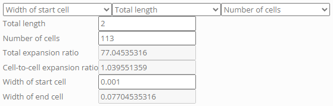
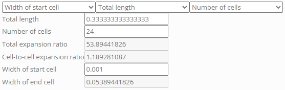

# Tutorial 3.2 – OpenFOAM Setup

##  Table of Contents
- [Tutorial 3.2 – OpenFOAM Setup](#tutorial-32--openfoam-setup)
  - [Table of Contents](#table-of-contents)
  - [Case Description](#case-description)
  - [Getting Started](#getting-started)
  - [Modify the Physical Properties](#modify-the-physical-properties)
  - [Modifying Initial and Boundary Conditions](#modifying-initial-and-boundary-conditions)
  - [Mesh Setup](#mesh-setup)
  - [Editing the controlDict File](#editing-the-controldict-file)
  - [Note on fvScheme and fvSolution](#note-on-fvscheme-and-fvsolution)
  - [References](#references)

## Case Description 

The case we will work on is NASA's 2D zero pressure gradient flat plate case provided on the following pages: [https://turbmodels.larc.nasa.gov/flatplate_val.html](https://turbmodels.larc.nasa.gov/flatplate_val.html) and [https://turbmodels.larc.nasa.gov/flatplate.html](https://turbmodels.larc.nasa.gov/flatplate.html).

The plate is 2 meters in length, which is sufficient to observe the full development of the boundary layer from its initiation at the leading edge to a fully developed turbulent state. The width of the plate is considered infinite for the purpose of this two-dimensional study, eliminating side effects. However, it's important to note that turbulence is inherently a three-dimensional phenomenon, and working in 2D will inevitably result in some error. That said, we will work within the framework of RANS, which is more forgiving to this assumption.

A fluid flows over the plate at $`M = 0.2`$ and with a temperature of 300 K. Under ideal gas assumption, the inlet velocity is thus $`U_\infty = 69.44 \frac{m}{s}`$. The Reynolds number (Re) per unit length of 1 is given as 5 million, so the kinematic viscosity is:

```math
\nu = 1.389\times10^{-5} \frac{m^2}{s}
```

The inlet boundary conditions are given as follows ([https://turbmodels.larc.nasa.gov/flatplate_sst.html](https://turbmodels.larc.nasa.gov/flatplate_sst.html)):

```math
k_{far-field} = 9\times10^{-9}(\frac{U_\infty}{M})^2 = 1.085\times10^{-3} \frac{m^2}{s^2}
```

```math
\omega_{far-field} = 1\times10^{-6}\frac{1}{\nu}(\frac{U_\infty}{M})^2 = 8679.7 \frac{1}{s}
```

The freestream turbulent eddy viscosity is given as $`\mu_t/\mu_{\infty} = 0.009`$, thus:

```math
\nu_t = 1.25\times10^{-7} \frac{m^2}{s}
```

Here is a schematic of the problem:

<figure>

<figcaption>

Figure: Flate plate boundary conditions [turbmodels.larc.nasa.gov](https://turbmodels.larc.nasa.gov/flatplate.html).

</figcaption>
</figure>

## Getting Started

We will solve this case using a steady-state solver. Let's start by finding a relevant tutorial. To do this, we will use the `find` command to search through the file contents as follows:

```bash
find $FOAM_TUTORIALS/incompressibleFluid -type f | xargs grep -sl 'steady'
```

This command will output all the tutorial files in the `incompressibleFluid` solver directory that contain the word 'steady'. We will use the 'pitzDailySteady' case setup and copy it into our '$FOAM_RUN' directory with the name "turbulent_flatplate_k_w":

```bash
cp -r $FOAM_TUTORIALS/incompressibleFluid/pitzDailySteady $FOAM_RUN/turbulent_flatplate_k_w
```

Next, navigate to the newly copied directory:

```bash
cd turbulent_flatplate_k_w
```

In the copied directory, there are several files that are not relevant for our simulation. Remove these unnecessary files to avoid confusion:

```bash
rm -rf 0/f 0/nuTilda 0/v2
```

## Modify the Physical Properties

Change the kinematic viscosity ($`\nu`$) to match the desired turbulent flow conditions. Edit the 'constant/physicalProperties' file:

```cpp
nu              [0 2 -1 0 0 0 0] 1.389e-5;
```

Specify the simulation type as Reynolds-Averaged Navier-Stokes (RAS) and the turbulence model as $`k-\omega`$ $`SST`$ in the 'constant/momentumTransport' file:

```cpp
simulationType RAS;

RAS
{
    model           kOmegaSST;

    turbulence      on;

    printCoeffs     on;

    viscosityModel  Newtonian;
}
```

There are many more turbulence models available in **OpenFOAM**.

## Modifying Initial and Boundary Conditions

Next, we will define the initial and boundary conditions similar to how we did it in the laminar flat plate simulation.

Edit the '0/U' file:

```bash
gedit 0/U
```

```cpp
internalField   uniform (69.44 0 0);

boundaryField
{
    inlet
    {
        type            freestreamVelocity;
        freestreamValue $internalField;
    }
    
    outlet
    {
        type        inletOutlet;
        phi         phi;
        inletValue  uniform (0 0 0);
        value       $internalField;
    }

    top
    {
        type            slip;
    }

    bottom
    {
        type            noSlip;
    }

    bottomslip
    {
        type            slip;
    }

    frontAndBack
    {
        type            empty;
    }
}
```

Edit the '0/p' file:

```bash
gedit 0/p
```

```cpp
internalField   uniform 0;

boundaryField
{
    inlet
    {
        type            freestreamPressure;
        freestreamValue $internalField;
    }

    outlet
    {
        type            freestreamPressure;
        freestreamValue $internalField;
    }

    top
    {
        type            zeroGradient;
    }

    bottom
    {
        type            zeroGradient;
    }

    bottomslip
    {
        type            zeroGradient;
    }
    
    frontAndBack
    {
        type            empty;
    }
}
```

Edit the '0/k' file:

```bash
gedit 0/k
```

```cpp
internalField   uniform 1.085e-3;

boundaryField
{
    inlet
    {
        type            fixedValue;
        value           $internalField;
    }

    outlet
    {
        type            zeroGradient;
    }

    top
    {
        type            zeroGradient;
    }

    bottom
    {
        type            kqRWallFunction;
        value           $internalField;
    }

    bottomslip
    {
        type            zeroGradient;
    }
    
    frontAndBack
    {
        type            empty;
    }
}
```

For our simulation, we set the initial value of the turbulent kinetic energy ($`k`$) in the '0/k' file as $`1.085\times10^{-3} \frac{m^2}{s^2}`$. This value is calculated based on the freestream conditions, ensuring that the turbulence characteristics at the inlet are accurately represented. By defining $`k`$ at the inlet as a fixed value, we establish the initial turbulence intensity of the incoming flow. This helps in accurately capturing the effects of turbulence from the onset of the simulation. 

For the boundary conditions at the wall, we use the 'kqRWallFunction'. This function is specifically designed for near-wall treatment in RANS simulations. It ensures that the $`k`$ near the wall is modeled correctly, accounting for the damping effect and the reduced turbulence intensity close to solid boundaries. By using this wall function, the simulation can more accurately predict the boundary layer characteristics, which are crucial for determining the drag and heat transfer rates along the flat plate.

Edit the '0/omega' file:

```bash
gedit 0/omega
```

```cpp
internalField   uniform 8679.7;

boundaryField
{
    inlet
    {
        type            fixedValue;
        value           $internalField;
    }

    outlet
    {
        type            zeroGradient;
    }

    top
    {
        type            zeroGradient;
    }

    bottom
    {
        type            omegaWallFunction;
        value           $internalField;
    }

    bottomslip
    {
        type            zeroGradient;
    }
    
    frontAndBack
    {
        type            empty;
    }
}
```

The specific dissipation rate ($`\omega`$) is another crucial quantity in turbulence modeling, representing the rate at which $`k`$ is dissipated. For our simulation, we need to define appropriate boundary conditions for $`\omega`$ to ensure the accurate representation of turbulence characteristics, especially near the wall. The 'omegaWallFunction' is specifically designed for the near-wall treatment in RANS simulations. Near walls, the turbulence structure changes significantly due to the no-slip condition and viscous effects. The 'omegaWallFunction' helps in correctly modeling the increase in $`\omega`$ close to the wall, reflecting the higher dissipation rates typical in these regions.

Edit the '0/nut' file:

```bash
gedit 0/nut
```

```cpp
internalField   uniform 1.25e-7;

boundaryField
{
    inlet
    {
        type            calculated;
        value           uniform 0;
    }

    outlet
    {
        type            calculated;
        value           uniform 0;
    }

    top
    {
        type            zeroGradient;
    }

    bottom
    {
        type            nutkWallFunction;
        value           $internalField;
    }

    bottomslip
    {
        type            zeroGradient;
    }
    
    frontAndBack
    {
        type            empty;
    }
}
```

The turbulent viscosity ($`\nu_t`$) represents the additional viscosity due to turbulence. The 'nutkWallFunction' helps in correctly modeling the increase in close to the wall, reflecting the higher turbulence intensity typical in these regions.

## Mesh Setup

To accurately capture the boundary layer development over the flat plate, the mesh must be fine enough near the wall where the gradients are highest. In the laminar case, we used 'simpleGrading' to specify some non-uniform cell sizes within a block. We will now use two blocks and make a more informed guess for the spacing.

First, we find a correlation for the local skin friction to get the order of magnitude of the desired value. There are multiple correlations available for the turbulent flat plate case ([www.cfd-online.com/Wiki](https://www.cfd-online.com/Wiki/Skin_friction_coefficient)). We will use:

```math
C_f = 0.0592Re_x^{-0.2} = 2.707\times10^{-3}
```

Let's say we are interested in a value of $`y^+ = \frac{yu_\tau}{\nu} = 1`$ at $`x = 1`$, thus we can derive the needed height of the first cell centroid above the wall:

```math
y_1 = \frac{y^+\nu}{u_{\tau_w}} = \frac{y^+\nu}{\sqrt{\frac{\tau_w}{\rho}}} = \frac{y^+\nu}{\sqrt{0.5C_fU^2}} = 5.4368\times10^{-6} \, \text{m}
```

The cell center is half of the mesh spacing, so our first guess for the first layer would be $`2y_1 = 1.087\times10^{-5} m`$.

Now, we need to decide the number of cells. As our comparison is NASA's case, we can apply a mesh size similar to one of theirs ([flatplate_grids.html](https://turbmodels.larc.nasa.gov/flatplate_grids.html)). Specifically, we will use the 137 by 97 grid (with 113 points on the solid plate).

The 'simpleGrading' function creates a geometric series. Knowing the first layer height and the number of cells, we can calculate the cell expansion ratio using the following calculator - [blockMesh_grading_calculation](https://openfoamwiki.net/index.php/Scripts/blockMesh_grading_calculation).

The expansion ratio in the y direction is calculated as follows:


Using a first layer width of 0.001, the expansion ratio in the positive x direction is:



The expansion ratio in the negative x direction is the inverse:



For convenience, we will scale the size by 0.333333333333333 to have more rounded values in the vertices definition.

The setup for the mesh in 'system/blockMeshDict' is as follows:

```cpp
convertToMeters 0.333333333333333;

vertices
(
    (-1 0 0)  //0
    ( 0 0 0)  //1
    ( 6 0 0)  //2
    (-1 3 0)  //3
    ( 0 3 0)  //4
    ( 6 3 0)  //5

    (-1 0 0.3) //6
    ( 0 0 0.3) //7
    ( 6 0 0.3) //8
    (-1 3 0.3) //9
    ( 0 3 0.3) //10
    ( 6 3 0.3) //11
);

blocks
(
    hex (0 1 4 3 6 7 10 9) (24 97 1) simpleGrading (0.01855 8248 1)
    hex (1 2 5 4 7 8 11 10) (113 97 1) simpleGrading (77.045 8248 1)
);

boundary
(
    inlet
    {
        type patch;
        faces
        (
            (0 6 3 9)
        );
    }
    outlet
    {
        type patch;
        faces
        (
            (2 5 11 8)
        );
    }
    top
    {
        type wall;
        faces
        (
            (3 9 10 4)
            (4 10 11 5)
        );
    }
    bottom
    {
        type wall;
        faces
        (
            (1 2 8 7)
        );
    }
    bottomslip
    {
        type wall;
        faces
        (
            (0 1 7 6)
        );
    }
    frontAndBack
    {
        type empty;
        faces
        (
            (0 3 4 1)
            (1 4 5 2)
            (6 7 10 9)
            (7 8 11 10)
        );
    }
);

mergePatchPairs
(
);
```

## Editing the controlDict File

In the 'system/controlDict' file, remove the "cacheTemporaryObjects" and "functions" lines at the end of the file and change the end time to 1000 and the writing time interval to 100.

## Note on fvScheme and fvSolution

The 'fvSchemes' file in **OpenFOAM** defines the numerical schemes used for various terms in the governing equations. These schemes are crucial for the accuracy and stability of the simulation. In the 'fvSchemes' file we copied, you will find time derivative, gradient, divergence, Laplacian, interpolation, surface normal gradient, and wall distances schemes.

It is important to note that the scheme for the time derivative is 'steadyState'. This indicates that the simulation is steady-state, meaning no time-dependent calculations are performed.

The 'fvSolution' file in **OpenFOAM** defines the solution algorithms and parameters used for the simulation. Since we are performing a steady-state simulation, the SIMPLE (Semi-Implicit Method for Pressure-Linked Equations) algorithm is utilized. The SIMPLE algorithm is an iterative method for solving the Navier-Stokes equations for incompressible flow, commonly used in steady-state CFD simulations.

In the SIMPLE section we can control the residual parameters dictating the criteria for the iterative solution to be considered converged. Residuals represent the difference between the left-hand side and the right-hand side of the discretized equations; lower residuals indicate that the solution is approaching an accurate and stable state.

Change the residual control parameters to stricter tolerances to ensure the equations are accurately resolved: 

```cpp
SIMPLE
{
    nNonOrthogonalCorrectors 0;
    consistent      yes;

    residualControl
    {
        p               1e-5;
        U               1e-5;
        "(k|epsilon|omega)" 1e-5;
    }
}
```

## References

[https://doc.cfd.direct/openfoam/user-guide-v11/turbulence](https://doc.cfd.direct/openfoam/user-guide-v11/turbulence) 

[https://doc.cfd.direct/notes/cfd-general-principles/turbulent-dissipation-rate](https://doc.cfd.direct/notes/cfd-general-principles/turbulent-dissipation-rate)

[https://doc.cfd.direct/notes/cfd-general-principles/specific-dissipation-rate](https://doc.cfd.direct/notes/cfd-general-principles/specific-dissipation-rate)

[https://www.simscale.com/docs/simulation-setup/global-settings/k-omega-sst/](https://www.simscale.com/docs/simulation-setup/global-settings/k-omega-sst/)

[https://turbmodels.larc.nasa.gov/flatplate.html](https://turbmodels.larc.nasa.gov/flatplate.html)

[https://turbmodels.larc.nasa.gov/noteonrunning.html](https://turbmodels.larc.nasa.gov/noteonrunning.html)

[https://doc.openfoam.com/2306/examples/verification-validation/turbulent/flat-plate-zpg/](https://doc.openfoam.com/2306/examples/verification-validation/turbulent/flat-plate-zpg/)

[https://tariqkhamlaj.com/2018/11/27/flow-over-a-flat-plate/](https://tariqkhamlaj.com/2018/11/27/flow-over-a-flat-plate/)

[https://spoken-tutorial.org/watch/OpenFOAM+version+7/Simulation+a+2D+Turbulent+Flow+in+a+Channel+using+OpenFOAM/English/](https://spoken-tutorial.org/watch/OpenFOAM+version+7/Simulation+a+2D+Turbulent+Flow+in+a+Channel+using+OpenFOAM/English/)

[https://turbmodels.larc.nasa.gov/Papers/ChangesToOpenFOAM.pdf](https://turbmodels.larc.nasa.gov/Papers/ChangesToOpenFOAM.pdf)

[https://cfdisraelblog.com/2021/11/08/simple-algorithm-way-to-solve-incompressible-nv-stokes-equation/](https://cfdisraelblog.com/2021/11/08/simple-algorithm-way-to-solve-incompressible-nv-stokes-equation/)

[https://turbmodels.larc.nasa.gov/flatplate_val_ypluseffect.html](https://turbmodels.larc.nasa.gov/flatplate_val_ypluseffect.html)