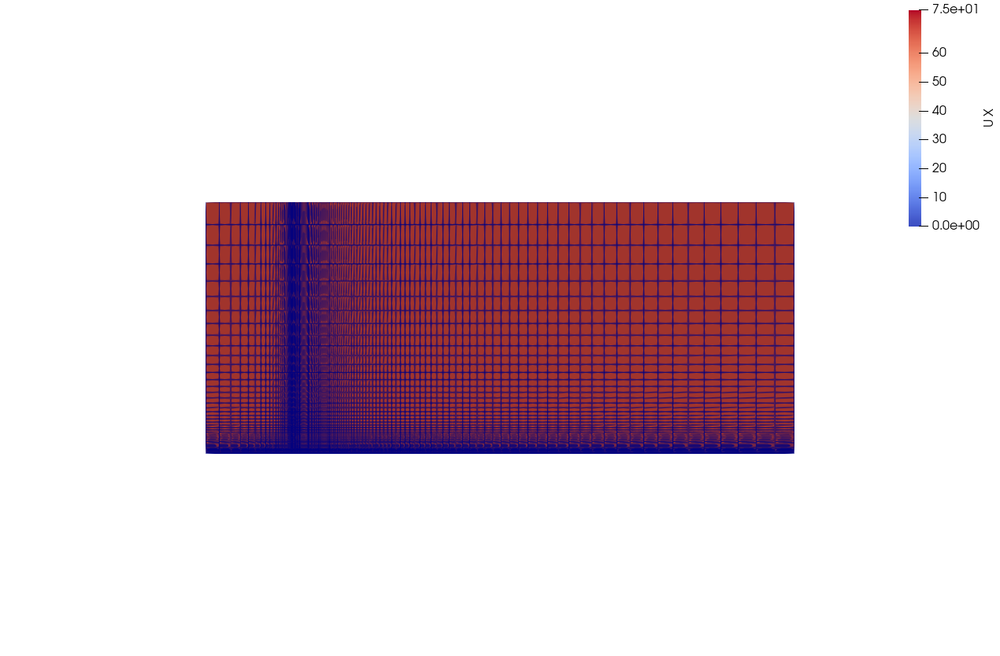
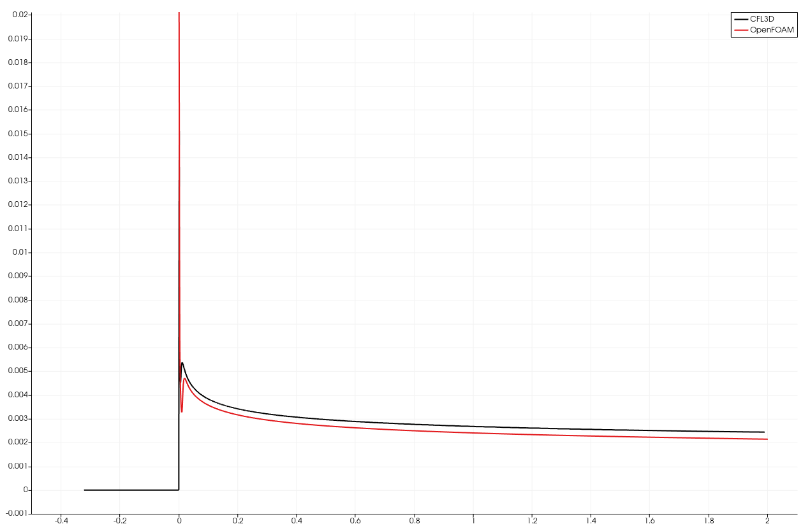

# Tutorial 3.3 – Running the Simulation and Post-Processing

##  Table of Contents
- [Tutorial 3.3 – Running the Simulation and Post-Processing](#tutorial-33--running-the-simulation-and-post-processing)
  - [Table of Contents](#table-of-contents)
  - [Running the Simulation](#running-the-simulation)
  - [Post-Processing the Solution](#post-processing-the-solution)
  - [Visualizing the Results](#visualizing-the-results)
  - [Exploratory exercises](#exploratory-exercises)
  - [References](#references)

## Running the Simulation

In the directory we copied, there is file named "Allrun". We can use this file to run all the necessary commands. 

First, open the file:

```bash
gedit Allrun
```

Then copy the following script into the file, replacing the existing content:

```bash
#!/bin/bash

# Exit immediately if any command fails
set -e

# Clean the case and remove the logs directory if it exists
foamCleanCase
rm -rf logs

# Change to the script's directory
cd "${0%/*}" || exit 1

# Source the OpenFOAM run functions
. "${WM_PROJECT_DIR:?}/bin/tools/RunFunctions"

# Get the application name
application=$(getApplication)

# Run the required OpenFOAM applications
runApplication blockMesh
runApplication checkMesh

# Create an empty log file for foamRun
: > log.foamRun

# Start tailing the foamRun log file in the background
tail -f log.foamRun &

# Store the PID of the tail process
TAIL_PID=$!

# Run the main application and log output to log.foamRun
foamRun | tee log.foamRun

# Kill the tail process once foamRun finishes
kill $TAIL_PID

#------------------------------------------------------------------------------
```

Now, to clean the directory (if it's not the first time you run the case), generate and check the mesh, and run the simulation, use the following command in the terminal:

```bash
bash ./Allrun
```

## Post-Processing the Solution

Next, we will create a file to post-process our last iteration of the solution.

Create and open a new file:

```bash 
gedit Lastpost
```

In the 'Lastpost' file, paste the following script:

```bash
#!/bin/bash

# Exit immediately if any command fails
set -e

# Process the log file
foamLog log.foamRun

# Calculate wall shear stress
foamPostProcess -solver incompressibleFluid -func wallShearStress -latestTime

# Create an empty .foam file to use in ParaView
touch plate.foam

#------------------------------------------------------------------------------
```

You can also add a line to plot the residuals as we did in the previous tutorials.

Now, you can run the post-processing script using the following command in the terminal:

```bash
bash ./Lastpost
```

## Visualizing the Results

1. Transfer the simulation data to your Windows system for visualization by using the following command:
  
   ```bash
   cp -r $FOAM_RUN/turbulent_flatplate_k_w /mnt/c/Users/<YourUserName>/Downloads/
   ```

   Replace '\<YourUserName\>' with your actual Windows username.

2. Visualizing the results in **ParaView**:
   - Open **ParaView** from your Windows start menu and load 'plate.foam' file.
   - Visualize 'U_x' and mesh edges.

   Here is what you should see if everything is done correctly:



3. Calculate and plot the skin friction coefficient ($`C_f`$) as we did in the previous tutorial, and compare the obtained $`C_f`$ profile to NASA's solution for a turbulent boundary layer ([Cf_turbulent137x97](Cf_turbulent137x97)).



## Exploratory exercises

In this exploratory exercise, you will experiment with different configurations and parameters to deepen your understanding of the solver and the simulation process.

1. Change the solver to unsteady.
   - Modify the simulation to run in an unsteady (transient) mode, similar to the cavity and laminar flat plate cases you worked on earlier.
   - Adjust the time step size and end time to reflect an unsteady simulation.
2. Try different mesh sizes.
3. Try Different Turbulence Models.
   - Experiment with different turbulence models such as the Spalart-Allmaras model.
   - For guidance, refer to this example: [github.com/khamlajt1/Flow-Over-a-Flat-Plate](https://github.com/khamlajt1/Flow-Over-a-Flat-Plate).
4. Reconstruct the law-of-the-wall profile.
   - Once you have identified the configuration that gives the best results, extract the velocity data along a line from (1 0 0.05) to (1 1 0.05).
   - Save the data by going to 'File &rarr; Save Data' and choosing CSV as the format.
   - In your prefered software, edit the data and normalize the velocity and distance from the wall as elaborated in Tutorial 3.1 to reconstruct the law-of-the-wall profile.
   - Plot the normalized velocity ($`U^+`$) against the normalized distance ($`y^+`$) to compare with the theoretical models for the different regions of the law-of-the-wall profile.

## References
[https://www.tfd.chalmers.se/~hani/kurser/OS_CFD_2016/FangqingLiu/openfoamFinal.pdf](https://www.tfd.chalmers.se/~hani/kurser/OS_CFD_2016/FangqingLiu/openfoamFinal.pdf)

[https://develop.openfoam.com/Development/openfoam/-/tree/OpenFOAM-v2306/tutorials/incompressible/simpleFoam/turbulentFlatPlate](https://develop.openfoam.com/Development/openfoam/-/tree/OpenFOAM-v2306/tutorials/incompressible/simpleFoam/turbulentFlatPlate)   

[https://medium.com/@mustafaabbs2/wall-functions-in-openfoam-implementation-in-code-959eccc4e311](https://medium.com/@mustafaabbs2/wall-functions-in-openfoam-implementation-in-code-959eccc4e311)

[https://www.simscale.com/forum/t/what-is-y-yplus/82394](https://www.simscale.com/forum/t/what-is-y-yplus/82394)

[https://su2code.github.io/tutorials/Turbulent_Flat_Plate/](https://su2code.github.io/tutorials/Turbulent_Flat_Plate/)