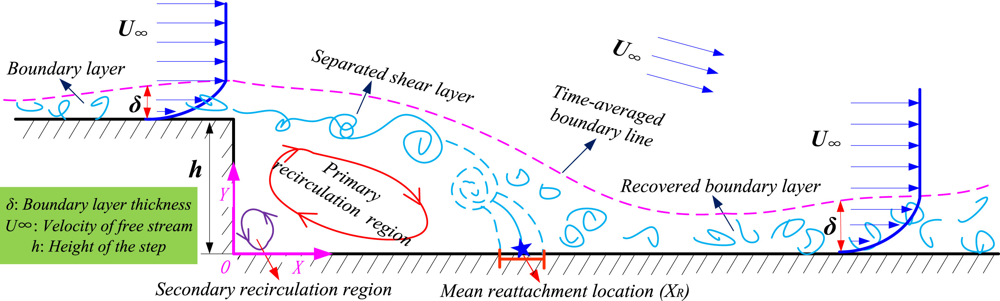

# Tutorial 4 – Flow Over a Backward-Facing Step

##  Table of Contents
- [Tutorial 4 – Flow Over a Backward-Facing Step](#tutorial-4--flow-over-a-backward-facing-step)
  - [Table of Contents](#table-of-contents)
  - [Introduction](#introduction)
  - [Background](#background)
  - [Steps to Follow](#steps-to-follow)
  - [References](#references)

## Introduction

Up until now, we have covered the basics of fluid dynamics theory and the solution of "basic" problems. Now, we will explore a standard benchmark case that showcases a combination of complex phenomena, specifically boundary layers and separation flow.

## Background

Backward-facing step (BFS) flow is a representative model for separation flows, which can be widely seen in aerodynamic flows, engine flows, condensers, vehicles, heat transfer systems, etc. The problem consists of a fully developed turbulent flow that enters the domain. When the flow reaches the step, because of the expansion of the flow channel, a pressure-gradient exists, causing it to detach and form a recirculation zone, as depicted in the figure below.

<figure>

<figcaption>

Figure: Sketch of the flow characteristics of the fluid passing a backward-facing step. [Guo et al. (2017)](https://www.sciencedirect.com/science/article/pii/S0094576516311432?via%3Dihub#f0030).
</figcaption>
</figure>

The turbulent boundary layer encounters a sudden back step, causing flow separation. Later, the flow eventually re-attaches to the bottom wall. The flow separation after a simple stage will introduce separation bubble formation, evolution, and re-attachment process, which is dependent on the BFS geometric design, the inlet and outlet conditions, turbulent intensity, as well as heat transfer conditions. The presence of a separated flow, together with a re-attaching flow, gives rise to increased unsteadiness, pressure fluctuations, structure vibrations, and noise, as it also exhibits an unsteady structure with a large-scale vortex in the separated shear layer and low-frequency motion around the re-attachment region with fluctuation of an instantaneous re-attachment point. This is a widely tested configuration.

You should go over the tutorial available as part of the **OpenFOAM** documentation guide - [Backward Facing Step](https://doc.cfd.direct/openfoam/user-guide-v11/backwardstep). Additionally, we advise you to try and modify the case to suit the particular setup tested by [Driver and Seegmiller](https://turbmodels.larc.nasa.gov/backstep_val.html) and compare the results of the simulation with the experimental results, discussing different issues regarding accuracy as highlighted in the tutorial.

## Steps to Follow

1. Go through the provided tutorial:
   - Follow the tutorial available in the **OpenFOAM** documentation to set up and run the BFS case. The guide provides detailed instructions on how to prepare the case, generate the mesh, and execute the 2D incompresible simulation. The tutorial case setup is also available in the tutorial files in '$FOAM_TUTORIALS/incompressibleFluid/pitzDailySteady'.
2. Modify the case to match Driver and Seegmiller's setup ([SimScale](https://www.simscale.com/docs/validation-cases/flow-reattachment-flow-over-a-backward-facing-step/)):
   - Adjust the geometry of the step and the dimensions of the computational domain to match those used by Driver and Seegmiller. 
   - Ensure that the inlet conditions, including velocity profile and turbulence parameters, match those specified in their experiments.
3. Run the simulation:
   - Execute the modified case and ensure that the simulation reaches convergence. Monitor the residuals and make sure they decrease to acceptable levels.
4. Post-processing:
   - Use **ParaView** to visualize the results. Focus on the velocity and pressure fields, and identify the recirculation zone and reattachment point.
   - Extract quantitative data such as velocity profiles and pressure distributions at various streamwise locations.
5. Compare results with Driver and Seegmiller:
   - Analyze the simulation results and compare them with the experimental data. Pay particular attention to the size and location of the recirculation zone, the reattachment length, and pressure distributions.
   - Discuss any discrepancies between the simulation results and the experimental data, and explore potential reasons for these differences.
6. Additional considerations:
   - Experiment with different turbulence models available in **OpenFOAM** (e.g., $`k-\epsilon`$ and $`k-\omega`$ $`SST`$) and compare their effects on the BFS flow. Determine which model provides results closest to the experimental data.
   - Conduct a mesh sensitivity analysis to evaluate the impact of mesh resolution on the simulation results. Use coarse, medium, and fine meshes to identify the optimal mesh density that balances accuracy and computational cost.

## References

[https://doc.cfd.direct/openfoam/user-guide-v11/backwardstep](https://doc.cfd.direct/openfoam/user-guide-v11/backwardstep)

[https://doc.cfd.direct/openfoam/user-guide-v11/blockmesh#x28-1500005.4](https://doc.cfd.direct/openfoam/user-guide-v11/blockmesh#x28-1500005.4)

[https://www.openfoam.com/documentation/tutorial-guide/3-compressible-flow/3.1-steady-turbulent-flow-over-a-backward-facing-step](https://www.openfoam.com/documentation/tutorial-guide/3-compressible-flow/3.1-steady-turbulent-flow-over-a-backward-facing-step)

[https://arc.aiaa.org/doi/abs/10.2514/3.8890?journalCode=aiaaj&](https://arc.aiaa.org/doi/abs/10.2514/3.8890?journalCode=aiaaj&)

[https://turbmodels.larc.nasa.gov/backstep_val.html](https://turbmodels.larc.nasa.gov/backstep_val.html)

[https://www.simscale.com/docs/validation-cases/flow-reattachment-flow-over-a-backward-facing-step/](https://www.simscale.com/docs/validation-cases/flow-reattachment-flow-over-a-backward-facing-step/)