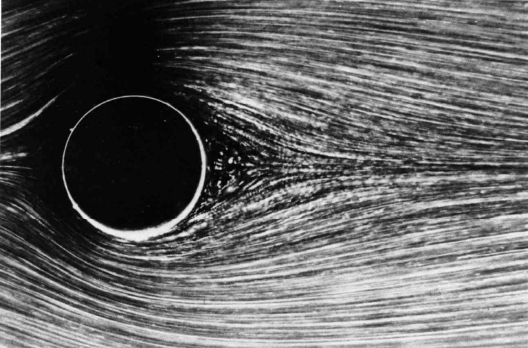
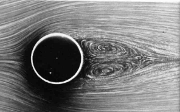
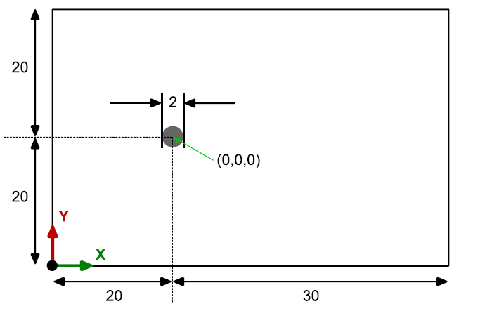
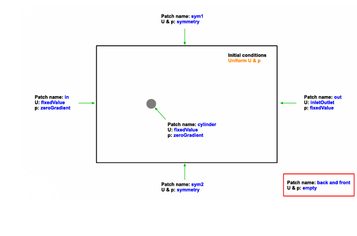
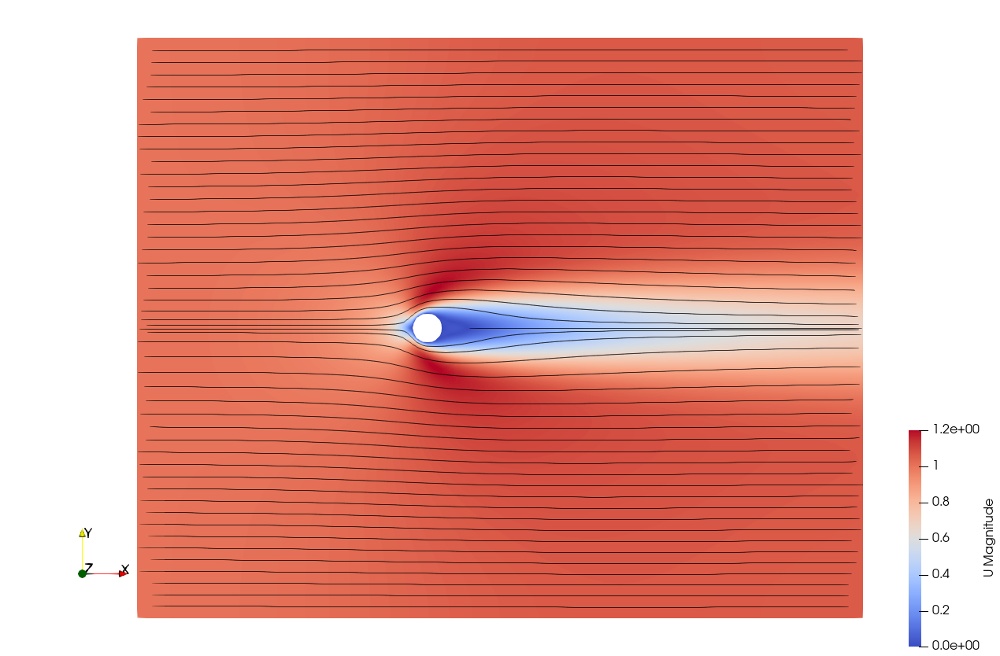
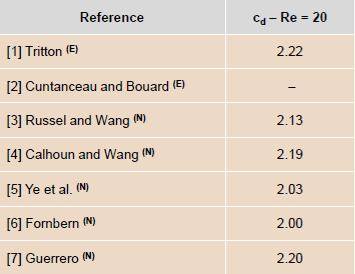
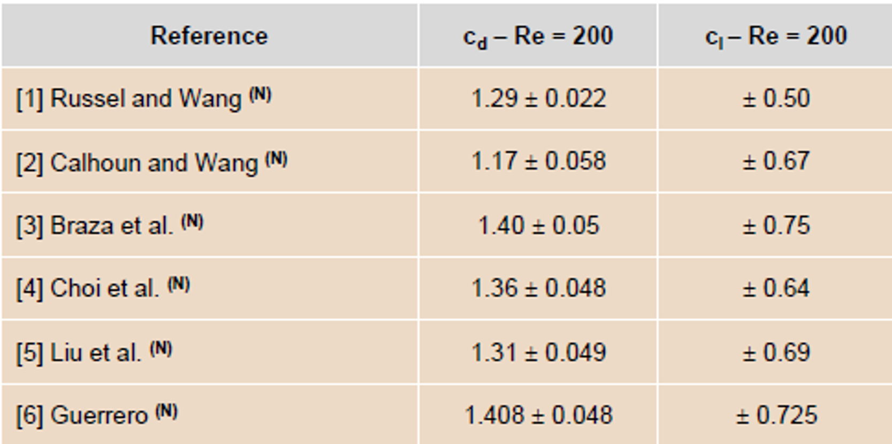
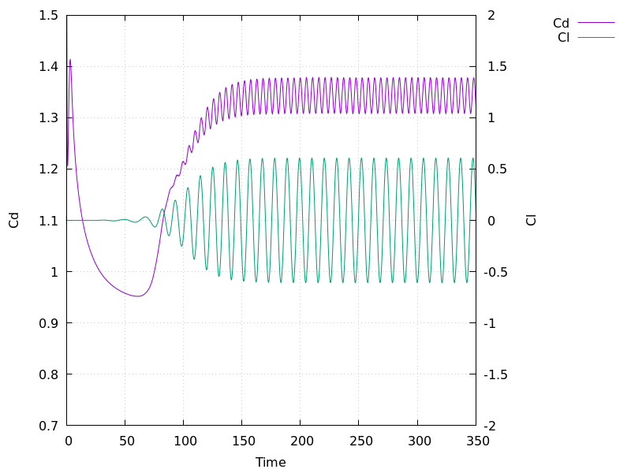

# Tutorial 5 – Flow Over a Cylinder (Vortex Shedding)

##  Table of Contents
- [Tutorial 5 – Flow Over a Cylinder (Vortex Shedding)](#tutorial-5--flow-over-a-cylinder-vortex-shedding)
  - [Table of Contents](#table-of-contents)
  - [Introduction](#introduction)
  - [Overview](#overview)
  - [Case Description](#case-description)
  - [Pre-Processing](#pre-processing)
  - [Editing the controlDict File](#editing-the-controldict-file)
  - [Mesh Setup](#mesh-setup)
  - [Modifying Initial and Boundary Conditions](#modifying-initial-and-boundary-conditions)
  - [Modify the Physical Properties](#modify-the-physical-properties)
  - [Include Force Coefficients Calculation](#include-force-coefficients-calculation)
  - [Running the Case](#running-the-case)
  - [Post-Processing the Solution](#post-processing-the-solution)
  - [Visualizing the Results](#visualizing-the-results)
  - [Validating the Solution](#validating-the-solution)
  - [References](#references)

## Introduction

Continuing from our exploration of flow separation and reattachment in the backward-facing step (BFS) case, we now delve into the flow over a circular cylinder. This case has been extensively used for both validation and research purposes due to its rich array of flow phenomena and engineering relevance. The flow over a cylinder starts as laminar, steady and symmetric, at low Reynolds numbers (below approximately 46), transitioning to periodic vortex shedding as the Reynolds number increases, and eventually becoming fully turbulent at high Reynolds numbers. This transition is characterized by the formation of a recirculation zone behind the cylinder and the periodic shedding of vortices, known as the Von Kármán vortex street. These vortices create alternating low-pressure zones, leading to oscillating lift forces on the cylinder.

Van Dyke's book, ["An Album of Fluid Motion"](https://courses.washington.edu/me431/handouts/Album-Fluid-Motion-Van-Dyke.pdf), is renowned for its beautiful and insightful flow visualization images. The book features a collection of high-quality photographs and illustrations that capture various flow phenomena, including the intricate patterns of flow over a cylinder at different Reynolds numbers. These images provide a visual understanding of flow behaviors such as laminar flow, vortex shedding, and turbulent wake formation, making complex fluid dynamics concepts more tangible and easier to comprehend.

<figure>
  <div style="display: flex; justify-content: space-between;">
    
    
  </div>
  <div style="margin-top: 10px;">
    
  </div>
  <div style="margin-top: 10px;">
    
  </div>
  <figcaption>

   Figure: Flow pattern generated around a circular cylinder for Reynolds numbers of 9.6 (top-left), 26 (bottom-right), 140 (center), and 2000 (bottom), from Van Dyke's book.
   
  </figcaption>
</figure>

The images from Van Dyke's book serve as an excellent reference for comparing your simulation results and understanding the transition in flow regimes. They highlight the critical flow features and provide a benchmark for validating numerical simulations.

## Overview

In this tutorial, we once again solve the incompressible Navier-Stokes equations. The tutorial aims to replicate the flow regimes over a cylinder and provide a comprehensive analysis of the resulting flow fields, pressure distributions, and force coefficients.

We will follow the detailed procedure provided by [Joel Guerrero](http://www.wolfdynamics.com/wiki/tut_2D_cylinder.pdf) from [Wolf Dynamics](http://www.wolfdynamics.com/) in their tutorial, which covers various aspects of the simulation setup and execution. We highly recommend referring to their guide for additional features and advanced techniques not discussed in this tutorial.

## Case Description 

The simulation setup involves a circular cylinder in a 2D domain. The schematic and dimensions of the setup are illustrated below:

<figure>

<figcaption>

Figure: Schematic of the flow over cylinder problem [Wolf Dynamics](http://www.wolfdynamics.com/wiki/tut_2D_cylinder.pdf).

</figcaption>
</figure>

The boundary conditions for the simulation are specified as follows:

<figure>

<figcaption>

Figure: Boundary conditions [Wolf Dynamics](http://www.wolfdynamics.com/wiki/tut_2D_cylinder.pdf).

</figcaption>
</figure>

## Pre-Processing

We will start by simulating laminar cases. As such, we will use our 'laminar flow over flat plate' case from [Tutorial 2](Tutorial_2/Tutorial_2/README.md) as a basis. Copy the clean case into a new directory named "vortex_shedding_Re20" in your run directory '$FOAM_RUN'.

Next, navigate to the newly copied directory:

```bash
cd vortex_shedding_Re20
```

## Editing the controlDict File

In the 'system/controlDict' file, make the following changes:

```cpp
application     foamRun;

solver          incompressibleFluid;

startFrom       startTime;

startTime       0;

stopAt          endTime;

endTime         350;

deltaT          0.05;

writeControl    runTime;

writeInterval   1;

purgeWrite      0;

writeFormat     ascii;

writePrecision  6;

writeCompression off;

timeFormat      general;

timePrecision   6;

runTimeModifiable true;

functions
{
    #include "forceCoeffs"
}
```

This configuration defines a run time of 350 seconds, with a time step of 0.05 seconds, and a writing interval of every 1 second.

In addition a `forceCoeffs` function was included to calculate force coefficients such as drag and lift during the simulation.

## Mesh Setup

We will use the provided geometry and mesh setup generated by a third-party software, [Ansys Fluent](https://www.ansys.com/products/fluids/ansys-fluent), available [here](/Tutorial_5/fluent_ascii.msh). Wolf Dynamics also provided an additional mesh type for `blockMesh`, available [here](/Tutorial_5/blockMeshDict).

To convert the mesh from **Fluent** format to **OpenFOAM** format, use the `fluent3DMeshToFoam` utility available in **OpenFOAM**. For more mesh conversion utilities, see the documentation - [chapter 3.7.3](https://doc.cfd.direct/openfoam/user-guide-v11/standard-utilities#dx15-81009).

First, copy the **Fluent** mesh file into your case directory. Then convert the mesh:

```bash
fluent3DMeshToFoam fluent_ascii.msh
```

This will generate your mesh and place it in 'constant/polyMesh', instead of using `blockMesh`. However, we will need to edit it a bit. Open the file 'constant/polyMesh/boundary' and change the boundary type of 'front' and 'back' to 'empty'. So, you will have something like this:

```cpp
7
(
    out
    {
        type            patch;
        nFaces          80;
        startFace       18180;
    }
    sym1
    {
        type            symmetry;
        inGroups        List<word> 1(symmetry);
        nFaces          100;
        startFace       18260;
    }
    sym2
    {
        type            symmetry;
        inGroups        List<word> 1(symmetry);
        nFaces          100;
        startFace       18360;
    }
    in
    {
        type            patch;
        nFaces          80;
        startFace       18460;
    }
    cylinder
    {
        type            wall;
        inGroups        List<word> 1(wall);
        nFaces          80;
        startFace       18540;
    }
    back
    {
        type            empty;
        nFaces          9200;
        startFace       18620;
    }
    front
    {
        type            empty;
        nFaces          9200;
        startFace       27820;
    }
)
```

## Modifying Initial and Boundary Conditions

Edit the '0/U' file for the boundaries specified in the file 'constant/polyMesh/boundary':

```cpp
dimensions      [0 1 -1 0 0 0 0];

internalField   uniform (1 0 0);

boundaryField
{
    in
    {
        type        fixedValue;
        value       $internalField;
    }
    out
    {
        type        inletOutlet;
        phi         phi;
        inletValue  uniform (0 0 0);
        value       $internalField;
    }
    cylinder
    {
        type            noSlip;
    }
    sym1
    {
        type            symmetry;
    }
    sym2
    {
        type            symmetry;
    }
    back
    {
        type            empty;
    }
    front
    {
        type            empty;
    }
}
```

Edit the '0/p' file:

```cpp
dimensions      [0 2 -2 0 0 0 0];

internalField   uniform 0;

boundaryField
{
    in
    {
        type            zeroGradient;
    }
    out
    {
        type            fixedValue;
        value           $internalField;
    }
    cylinder
    {
        type            zeroGradient;
    }
    sym1
    {
        type            symmetry;
    }
    sym2
    {
        type            symmetry;
    }
    back
    {
        type            empty;
    }
    front
    {
        type            empty;
    }
}
```

We simulate a laminar case, so we only need to define the boundary and initial conditions for pressure and velocity.

## Modify the Physical Properties

Change the kinematic viscosity ($`\nu`$) to match the desired turbulent flow conditions. Our uniform inlet velocity is $`1 \frac{m}{s}`$, the cylinder diameter is $`2 m`$ and the desired Reynolds number is $`Re = 20`$, thus the kinematic viscosity is $`\nu = 0.1`$

Edit the 'constant/physicalProperties' file:

```cpp
nu              [0 2 -1 0 0 0 0] 0.1;
```

## Include Force Coefficients Calculation

In the 'system/controlDict' file we included the function `forceCoeffs` to calculate force coefficients during the simulation. You can read more about it [here](https://cpp.openfoam.org/v11/classFoam_1_1functionObjects_1_1forceCoeffs.html). 

First, let's find a case in '$FOAM_TUTORIALS' that already has this function:

```bash
grep -r "forceCoeffs" $FOAM_TUTORIALS/incompressibleFluid
```

In the output, we can see that a case named "motorBike" has such a file. Let's copy it to our system directory and edit it:

```bash
cp $FOAM_TUTORIALS/incompressibleFluid/motorBike/motorBike/system/forceCoeffs $FOAM_RUN/vortex_shedding_Re20/system/
```

Edit the file 'system/forceCoeffs' in accordance with the case geometry:

```cpp
forces
{
    type            forceCoeffs;
    libs            ("libforces.so");
    writeControl    timeStep;
    writeInterval   1;

    patches         (cylinder);
    rho             rhoInf;      // Indicates incompressible
    log             true;
    rhoInf          1.0;         // Redundant for incompressible
    liftDir         (0 1 0);
    dragDir         (1 0 0);
    CofR            (0 0 0);     // Axle midpoint on ground
    pitchAxis       (0 0 1);
    magUInf         1.0;
    lRef            1.0;
    Aref            2.0;
}
```

The 'patches' parameter lists the patches over which the forces are calculated, with 'cylinder' being the relevant patch for this case. The 'rho' parameter indicates the flow type, set to 'rhoInf' for incompressible flow. The 'rhoInf' parameter, redundant for incompressible flows, is set to 1.0. The 'liftDir' and 'dragDir' parameters specify the directions of the lift and drag forces, set to $'(0 1 0)'$ for the y-direction and $`(1 0 0)`$ for the x-direction, respectively. The 'CofR' parameter defines the center of rotation at $`(0 0 0)`$, and the 'pitchAxis' specifies the axis about which the pitching moment is calculated, set to $`(0 0 1)`$. The 'magUInf' parameter indicates the magnitude of the free-stream velocity, set to 1.0, while the 'lRef' and 'Aref' parameters define the reference length and reference area, set to 1.0 and 2.0, respectively. 

## Running the Case 

As in [Tutorial 3](Tutorial_3/Tutorial_3_3/README.md) we can run the necessary commands through a script.

First, create and open a new file::

```bash
gedit Allrun
```

Then copy the following script into the file:

```bash
#!/bin/bash

# Exit immediately if any command fails
set -e

# Clean the case and remove the logs directory if it exists
foamListTimes -rm
rm -rf logs
rm -rf postProcessing

# Change to the script's directory
cd "${0%/*}" || exit 1

# Source the OpenFOAM run functions
. "${WM_PROJECT_DIR:?}/bin/tools/RunFunctions"

# Get the application name
application=$(getApplication)

# Create an empty log file for foamRun
: > log.foamRun

# Start tailing the foamRun log file in the background
tail -f log.foamRun &

# Store the PID of the tail process
TAIL_PID=$!

# Run the main application and log output to log.foamRun
foamRun | tee log.foamRun

# Kill the tail process once foamRun finishes
kill $TAIL_PID
```

Now, to clean the directory (if it's not the first time you run the case), generate and check the mesh, and run the simulation, use the following command in the terminal:

```bash
bash ./Allrun
```

## Post-Processing the Solution

Next, we will create a file to post-process our solution.

Create and open a new file:

```bash 
gedit Allpost
```

In the 'Allpost' file, paste the following script:

```bash
#!/bin/bash

# Exit immediately if any command fails
set -e

# Process the log file
foamLog log.foamRun

# Calculate the velocity magnitude
foamPostProcess -solver incompressibleFluid -func "mag(U)"

# Calculate wall shear stress
foamPostProcess -solver incompressibleFluid -func wallShearStress

# Create an empty .foam file to use in ParaView
touch cylinder.foam
```

Now, you can run the post-processing script using the following command in the terminal:

```bash
bash ./Allpost
```

## Visualizing the Results

We can visualize the solution for the flow over the cylinder at $`Re = 20`$ as we did in all previous tutorials and obtain the following streamline pattern:



To observe the effects of a higher Reynolds number, we can increase the Reynolds number to $`Re = 200`$ by changing the kinematic viscosity to $`\nu = 0.01`$ and re-running the simulation. After making this adjustment, the resulting flow pattern will show more complex vortex shedding characteristics. 

The visualization for $`Re = 200`$ is illustrated below:


## Validating the Solution

As part of the tutorial, Wolf Dynamics gathered experimental and numerical results for flow over a cylinder at various Reynolds numbers:

<figure>
  <div style="margin-top: 10px;">
    
  </div>
  <div style="margin-top: 10px;">
    
  </div>
</figure>

Now, let's compare these results to ours.

For $`Re = 20`$, the flow is steady, so we can simply check the file 'postProcessing/forces/0/forceCoeffs.dat' and take the results from the last line:

```cpp
# Time        	Cm            	Cd            	Cl            
350           	-1.506503e-11	2.168293e+00	-2.188209e-09	
```

As you can see, the results are in the correct range. 

For $`Re = 200`$, the flow is unsteady, so let's plot the lift and drag coefficients using the following Gnuplot script:

```c
set terminal pngcairo size 800,600 enhanced font 'Verdana,12'
set output 'forceCoeffs.png'
set datafile separator '\t'
set xlabel "Time"
set ylabel "Cd"
set y2label "Cl"
set yrange  [0.7:1.5]
set y2range [-2:2]
set y2tics
set key outside
set grid

plot 'postProcessing/forces/0/forceCoeffs.dat' using 1:3 with lines title 'Cd' axis x1y1, \
     'postProcessing/forces/0/forceCoeffs.dat' using 1:4 with lines title 'Cl' axis x1y2
```

This script will generate the following plot:



The plot shows that the results are also within the expected range.

These comparisons demonstrate that the simulated results for both steady and unsteady flows over a cylinder at low Reynolds numbers are consistent with experimental and numerical data, validating the accuracy of our simulation setup.

## References

[http://www.wolfdynamics.com/wiki/tut_2D_cylinder.pdf](http://www.wolfdynamics.com/wiki/tut_2D_cylinder.pdf)

[https://courses.washington.edu/me431/handouts/Album-Fluid-Motion-Van-Dyke.pdf](https://courses.washington.edu/me431/handouts/Album-Fluid-Motion-Van-Dyke.pdf)

[https://www.openfoam.com/documentation/tutorial-guide/2-incompressible-flow/2.2-flow-around-a-cylinder](https://www.openfoam.com/documentation/tutorial-guide/2-incompressible-flow/2.2-flow-around-a-cylinder)

[https://innovationspace.ansys.com/courses/courses/simple-approximations-of-fluid-flows/lessons/simulation-examples-homework-quizzes/topic/unsteady-flow-over-a-cylinder-simulation-example/](https://innovationspace.ansys.com/courses/courses/simple-approximations-of-fluid-flows/lessons/simulation-examples-homework-quizzes/topic/unsteady-flow-over-a-cylinder-simulation-example/)