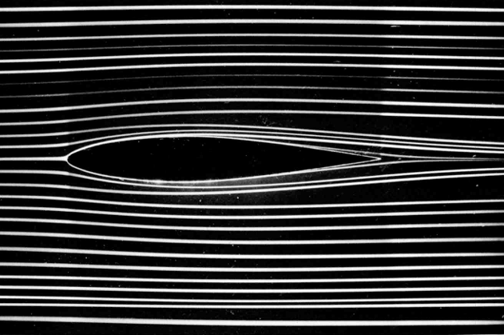
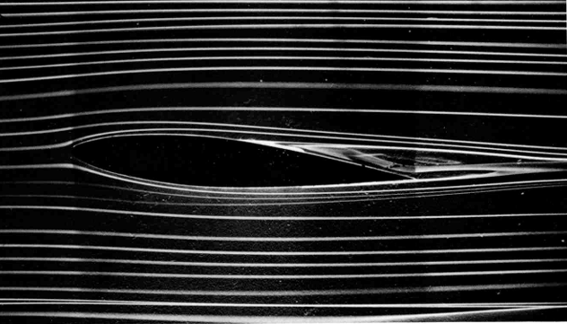
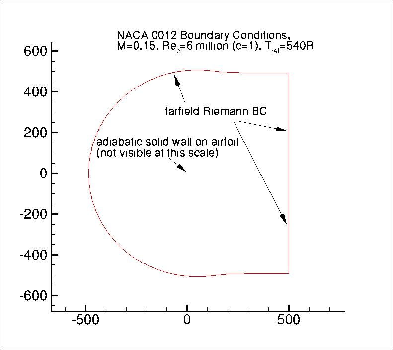
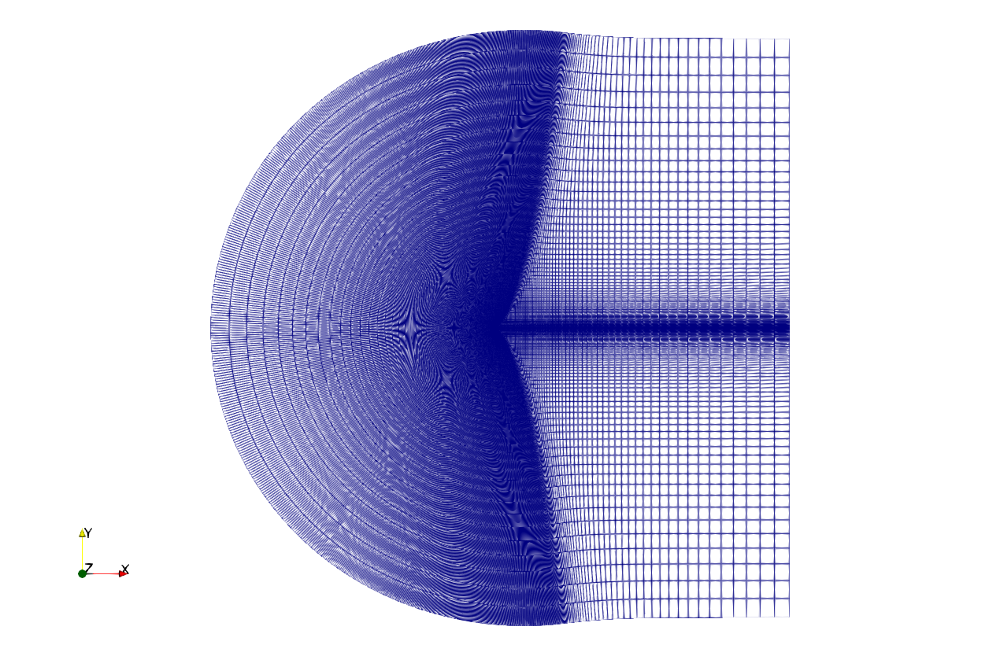
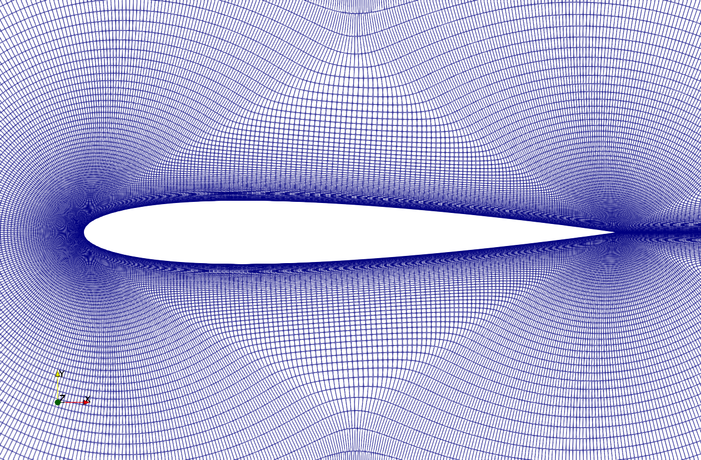
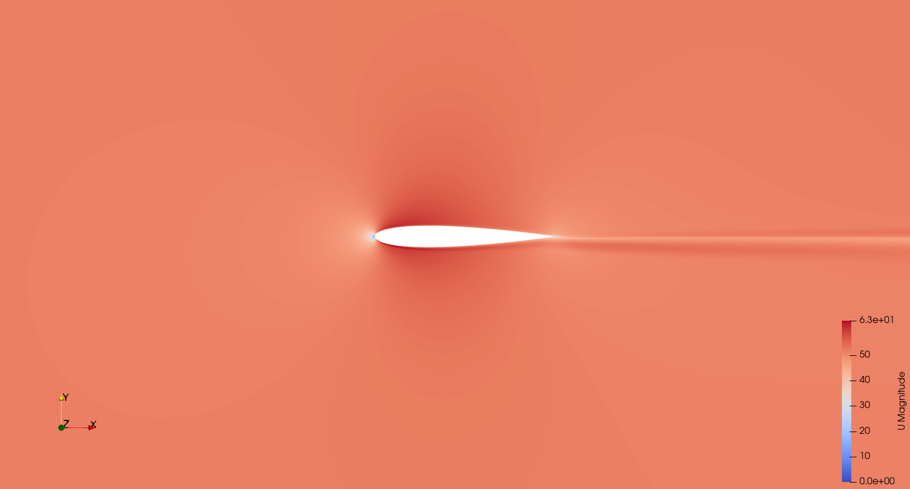
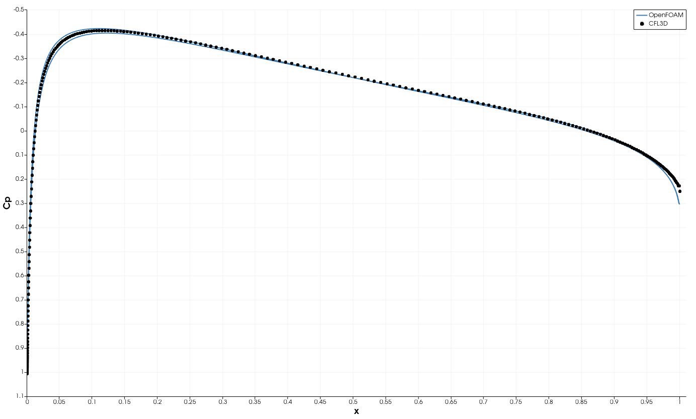

# Tutorial 6 – Flow over NACA0012 Airfoil

##  Table of Contents
- [Tutorial 6 – Flow over NACA0012 Airfoil](#tutorial-6--flow-over-naca0012-airfoil)
  - [Table of Contents](#table-of-contents)
  - [Introduction](#introduction)
  - [Overview](#overview)
  - [Case Description](#case-description)
  - [Setting Up NASA's Geometry and Mesh](#setting-up-nasas-geometry-and-mesh)
  - [Modify the Physical Properties](#modify-the-physical-properties)
  - [Reviewing the Turbulence Model](#reviewing-the-turbulence-model)
  - [Modifying Initial and Boundary Conditions](#modifying-initial-and-boundary-conditions)
  - [Reviewing the controlDict, fvSchemes and fvSolution Files](#reviewing-the-controldict-fvschemes-and-fvsolution-files)
  - [Running the Case](#running-the-case)
  - [Post-Processing the Solution](#post-processing-the-solution)
  - [Visualizing the Results](#visualizing-the-results)
  - [Validating the Solution](#validating-the-solution)
  - [References](#references)

## Introduction

In the study of fluid dynamics, the flow over an airfoil is a fundamental case that provides insight into aerodynamic performance and behavior. Airfoils are critical components in aerospace engineering, designed to generate lift while minimizing drag. The NACA0012 airfoil, in particular, is a symmetric airfoil that has been widely used for validation and research due to its simplicity and well-documented performance characteristics. Understanding the flow over NACA0012 involves exploring various flow regimes, from laminar to turbulent, and examining phenomena such as boundary layer development, flow separation, and stall.

The flow over an airfoil can be characterized by several distinct regimes and phenomena.At low Reynolds numbers, the flow remains laminar and smooth, with well-defined streamlines. The boundary layer is thin and stable. As the Reynolds number increases, the boundary layer transitions from laminar to turbulent. This transition can lead to increased drag but also delayed separation, which is beneficial for lift. At high angles of attack, the flow can separate from the airfoil surface, leading to a dramatic loss of lift and an increase in drag. This phenomenon, known as stall, is critical in the design and operation of airfoils.

<figure>
  <div style="display: flex; justify-content: space-between;">
    
    
  </div>
  <figcaption>

   Figure: Flow pattern generated around a NACA64A015 airfoil for Reynolds number of 7000 with an angle of attack of $`0\degree`$ (left) and $`5\degree`$ (right), from Van Dyke's book, ["An Album of Fluid Motion"](https://courses.washington.edu/me431/handouts/Album-Fluid-Motion-Van-Dyke.pdf)
   
  </figcaption>
</figure>

## Overview

In this tutorial, we will solve the incompressible Navier-Stokes equations for the flow over a NACA0012 airfoil. We will build the case according to NASA's setup as outlined in their [validation study](https://turbmodels.larc.nasa.gov/naca0012_val.html).

We will begin by using the mesh provided by NASA and convert it to run on **OpenFOAM**. Subsequently, we will introduce an additional utility in **OpenFOAM** that provides an option to load surfaces and mesh automatically. Finally, we will compare the performance of the different meshes.

## Case Description 

The simulation setup involves the NACA0012 airfoil in a 2D domain. The airfoil has a chord length of 1 m. The flow over the airfoil is set to Mach 0.15, which indicates subsonic conditions. This low Mach number ensures that compressibility effects are negligible and that the flow can be approximated as incompressible. The Reynolds number is set to 6 million. **OpenFOAM** (ESI Group) has already calculated all the necessary properties and set up the case for us, as detailed in their [verification and validation documentation](https://www.openfoam.com/documentation/guides/latest/doc/verification-validation-naca0012-airfoil-2d.html).

The schematic and dimensions of the setup are illustrated below:

<figure>

<figcaption>

Figure: Schematic of the flow over NACA0012 airfoil [NASA](https://turbmodels.larc.nasa.gov/naca0012_val.html).

</figcaption>
</figure>

The computational domain is designed with boundaries positioned approximately 500 chord lengths away from the airfoil. This large distance is chosen to minimize the impact of boundary conditions on the flow near the airfoil. By placing the boundaries so far from the airfoil, the simulation ensures that the flow development and wake are not artificially constrained, which enhances the accuracy of the results.

The computational domain has a C-shaped configuration. This design extends far downstream of the airfoil to allow the wake to fully develop. The C-shaped configuration also ensures that the incoming flow can be accurately represented without interference from the domain boundaries, which is critical for assessing the airflow as it approaches the airfoil.

## Setting Up NASA's Geometry and Mesh

We will start by copying an existing **OpenFOAM** tutorial case, preparing the given geometry and mesh from NASA, and then converting and manipulating the mesh to suit our requirements.

Copy the tutorial case to your run directory:

```bash 
cp -r $FOAM_TUTORIALS/incompressibleFluid/airFoil2D $FOAM_RUN/airfoil_naca0012
```

```bash 
cd $FOAM_RUN/airfoil_naca0012
```

Remove the existing mesh:

```bash
rm -rf $FOAM_RUN/airfoil_naca0012/constant/polyMesh
```

Now, download and unzip the NASA grid:

```bash
wget https://turbmodels.larc.nasa.gov/NACA0012_grids/n0012_897-257.p2dfmt.gz
```

```bash
gunzip n0012_897-257.p2dfmt.gz
```

Next, convert mesh to **OpenFOAM** format:

```bash
plot3dToFoam -2D 1 -noBlank -noFunctionObjects n0012_897-257.p2dfmt
```

Inspect the boundary file:

```bash
gedit constant/polyMesh/boundary
```

Initially, the boundary file will indicate that the entire geometry is in a single group of faces, as shown below. We need to split this into multiple patches.

```cpp
1
(
    defaultFaces
    {
        type            wall;
        inGroups        List<word> 1(wall);
        nFaces          460672;
        startFace       457792;
    }
)
```

Use `autoPatch` to split faces:

```bash
autoPatch 30 -overwrite
```

This command uses the `autoPatch` utility with an angle of 30 degrees to divide the external faces into patches. For more information on `autoPatch`, refer to the **OpenFOAM** [utilities guide](https://doc.cfd.direct/openfoam/user-guide-v11/standard-utilities#dx15-82003).

Open the mesh in **ParaView** to identify and inspect the newly created faces. These faces need to match our boundary conditions. You can rename them manually in the modified boundary file or using the `createPatch` utility.

Copy the 'createPatchDict' example from another tutorial to your system directory. 

```bash
grep -r "createPatchDict" $FOAM_TUTORIALS/incompressibleFluid
```

```bash
cp $FOAM_TUTORIALS/incompressibleFluid/wingMotion/wingMotion2D_steady/system/createPatchDict $FOAM_RUN/airfoil_naca0012/system
```

Modify it as needed to rename the identified boundaries and to stich the front and back face: 

```cpp
patches
(
    {
        name outlet;
        patchInfo
        {
            type patch;
        }
        constructFrom patches;
        patches (auto2);
    }
    {
        name walls;
        patchInfo
        {
            type wall;
        }
        constructFrom patches;
        patches (auto3);
    }
    {
        name inlet;
        patchInfo
        {
            type patch;
        }
        constructFrom patches;
        patches (auto4);
    }
    {
        name front;
        patchInfo
        {
            type empty;
        }
        constructFrom patches;
        patches (auto1);
    }
    {
        name back;
        patchInfo
        {
            type empty;
        }
        constructFrom patches;
        patches (auto0);
    }
);
```

Run the `createPatch` utility:

```bash
createPatch -overwrite
```

By following these steps, you will successfully set up the NACA0012 airfoil case with the provided NASA mesh and configure it to run in **OpenFOAM**.





## Modify the Physical Properties

To configure the physical properties for our simulation, we need to set the kinematic viscosity based on the given conditions. For an inlet velocity of (51.4815 0.0 0.0) $`\frac{m}{s}`$ at an angle of attack of 0 degrees, with a chord length of 1 m and a Reynolds number of 6 million, the kinematic viscosity is calculated as $`\nu = 8.58×10^{−6}`$ $`\frac{m^2}{s}`$.

```cpp
nu              [0 2 -1 0 0 0 0] 8.58e-06;
```

## Reviewing the Turbulence Model

In this simulation, the turbulence model for RANS equations closure is predefined as the [Spalart-Allmaras (SA) model](https://turbmodels.larc.nasa.gov/spalart.html#sa). This model is a one-equation turbulence model that solves a single transport equation for a modified turbulent viscosity ($`\nu_t`$). It is specifically designed for aerospace applications and is known for its robustness and relatively low computational cost. While it offers significant computational savings and simplicity, it has limitations in handling complex flow features and transitions compared to two-equation models like $`k-\epsilon`$ and $`k-\omega`$.  

## Modifying Initial and Boundary Conditions

To set up the initial and boundary conditions for the NACA0012 airfoil simulation, you need to edit the '0/U' file:

```cpp
internalField   uniform (51.4815 0 0);

boundaryField
{
    inlet
    {
        type            freestreamVelocity;
        freestreamValue $internalField;
    }
    outlet
    {
        type            freestreamVelocity;
        freestreamValue $internalField;
    }
    walls
    {
        type            noSlip;
    }
    front
    {
        type            empty;
    }
    back
    {
        type            empty;
    }
}
```

For simulating different angles of attack, you can change the velocity vector directly in the 'internalField' and boundary conditions without rotating the airfoil or remeshing the case.

The pressure boundary and initial conditions are properly set up, except for the merged front and back faces. These need to be split.

For the Spalart-Allmaras model we need to define two properties - $`\nu_t`$ and $`\tilde{\nu}`$.

Modify the '0/nut' file:

```cpp
dimensions      [0 2 -1 0 0 0 0];

internalField   uniform 8.58e-06;

boundaryField
{
    inlet
    {
        type            freestream;
        freestreamValue uniform 8.58e-06;
    }
    outlet
    {
        type            freestream;
        freestreamValue uniform 8.58e-06;
    }
    walls
    {
        type            nutUSpaldingWallFunction;
        value           uniform 0;
    }
    front
    {
        type            empty;
    }
    back
    {
        type            empty;
    }
}
```
 
Modify the '0/nuTilda' file:

```cpp
dimensions      [0 2 -1 0 0 0 0];

internalField   uniform 3.432e-05;

boundaryField
{
    inlet
    {
        type            freestream;
        freestreamValue uniform 3.432e-05;
    }
    outlet
    {
        type            freestream;
        freestreamValue uniform 3.432e-05;
    }
    walls
    {
        type            fixedValue;
        value           uniform 0;
    }
    front
    {
        type            empty;
    }
    back
    {
        type            empty;
    }
}
```

## Reviewing the controlDict, fvSchemes and fvSolution Files

The current setup defines a steady-state run with 500 iterations and a writing interval of every 50 iterations.

The 'fvSolution' file contains the solvers and algorithm controls used for solving the system of equations (see **OpenFOAM** [documentation](https://doc.cfd.direct/openfoam/user-guide-v11/fvsolution) for further elaboration). 

The solver 'GAMG' (Geometric-Algebraic Multi-Grid) with 'GaussSeidel' smoother is used for solving the pressure field efficiently. The tolerence, which is the absolute convergence criterion, is set to a small value like 1e-6. Relative tolerance for the solver is set to 0.01 to ensure significant convergence in each iteration. The solver 'PBiCG' (Preconditioned Bi-Conjugate Gradient) with 'DILU' (Diagonal Incomplete LU) preconditioner for convergence improvment is used for solving velocity and the turbulence quantities. Tolerence is set to 1e-8 and relative tolerance to 0.01.

 The SIMPLE algorithm is used for steady-state simulations. It includes parameters for residual control, i.e., the convergence critiria for each field.

 The relaxation factors are used to stabilize the iterative solution process by controlling the extent of change in each iteration.

## Running the Case 

We can execute the necessary commands through a script. First, modify the file 'Allrun':

```bash
#!/bin/sh

# Exit immediately if any command fails
set -e

# Change to the script's directory
cd "${0%/*}" || exit 1

# Source the OpenFOAM run functions
. "${WM_PROJECT_DIR:?}/bin/tools/RunFunctions"

# Get the application name
application=$(getApplication)

# Create an empty log file for foamRun
: > log.foamRun

# Start tailing the foamRun log file in the background
tail -f log.foamRun &

# Store the PID of the tail process
TAIL_PID=$!

# Run the main application and log output to log.foamRun
foamRun | tee log.foamRun

# Kill the tail process once foamRun finishes
kill $TAIL_PID
```

To clean the directory (if it's not the first time you run the case), generate and check the mesh, and run the simulation, use the following command in the terminal:

```bash
bash ./Allrun
```

This will take some time as we run on a single processor.

To run in parallel, we first need to define the decomposition of the mesh in a file named "decomposeParDict". Copy the 'decomposeParDict' example from another tutorial to your system directory:

```bash
grep -r "decomposeParDict" $FOAM_TUTORIALS/incompressibleFluid
```

```bash
cp $FOAM_TUTORIALS/incompressibleFluid/motorBike/motorBike/system/decomposeParDict $FOAM_RUN/airfoil_naca0012/system
```

There are several methods to decompose the mesh, as described in OpenFOAM's [documantation](https://doc.cfd.direct/openfoam/user-guide-v11/running-applications-parallel). We will use the scotch decomposition method as it is the most robust for our needs. Copy the following to the 'decomposeParDict' file:

```bash
numberOfSubdomains 4;

method          scotch;
```

To run the decomposition and then run the simulation in parallel, add the 'decomposePar' command to our script and modify our run command to 'mpirun -np 4 $application -parallel | tee log.foamRun' instead of the previous 'foamRun | tee log.foamRun'. Notice that 4 processors are used, which is identical to the number of subdomains we defined to decompose the mesh in the 'decomposeParDict' file. You can use more processors and accordingly increase the number of subdomains. After running the simulation, we need to reconstruct the mesh using the command 'reconstructPar'.

```bash
#!/bin/sh

# Exit immediately if any command fails
set -e

# Change to the script's directory
cd "${0%/*}" || exit 1

# Clean the case and remove the logs directory if it exists
foamListTimes -rm
rm -rf processor*
rm -f log.*
rm -rf logs
rm -rf postProcessing

# Source the OpenFOAM run functions
. "${WM_PROJECT_DIR:?}/bin/tools/RunFunctions"

# Get the application name
application=$(getApplication)

# Create an empty log file for foamRun
: > log.foamRun

# Start tailing the foamRun log file in the background
tail -f log.foamRun &

# Store the PID of the tail process
TAIL_PID=$!

# Run the main application and log output to log.foamRun
decomposePar
mpirun -np 4 $application -parallel | tee log.foamRun
reconstructPar

# Kill the tail process once foamRun finishes
kill $TAIL_PID
```

```bash
bash ./Allrun
```

## Post-Processing the Solution

Next, we will create a file to post-process our solution. Create and open a new file:

```bash 
gedit Lastpost
```

In the 'Lastpost' file, paste the following script:

```bash
#!/bin/bash

# Exit immediately if any command fails
set -e

# Process the log file
foamLog log.foamRun

# Calculate wall shear stress
foamPostProcess -solver incompressibleFluid -func wallShearStress -latestTime

# Create an empty .foam file to use in ParaView
touch airfoil.foam
```

Now, you can run the post-processing script using the following command in the terminal:

```bash
bash ./Lastpost
```

## Visualizing the Results

We can visualize the solution for the flow over the NACA0012 airfoil at a Reynolds number of 6 million, as we did in previous tutorials and obtain the following U magnitude distribution:



## Validating the Solution

To validate our results, we will compare them to NASA's data provided in the [Cp_897x257.csv](Cp_897x257.csv). To accomplish this, we need to extract the properties on the airfoil contour and overlay them with NASA's results.

First, we open our simulation results in **ParaView** by loading the '.foam' file created during post-processing. Within **ParaView**, we focus on the wall patch corresponding to the airfoil surface. To extract the airfoil contour, we use the 'Slice' feature to obtain a cross-section of the airfoil surface, which allows us to analyze the flow properties along this contour. With the airfoil contour selected, use the 'Calculator' to compute the pressure coefficient (Cp) using the equation: $`\frac{2p}{51.4815^2}`$. Apply the filter to create a new data array for Cp.

Next, navigate to 'Filters &rarr; Data Analysis' and select 'Plot Data'. This action generates a plot of the selected data along the airfoil contour, providing a visual representation of the calculated pressure coefficient.

Import NASA's data and overlay it on your plot. The final plot should clearly display the comparison, highlighting any discrepancies or confirming the accuracy of your simulation. The resulting plot will resemble the reference image, providing a visual confirmation of your simulation’s accuracy:



Having worked with a provided detailed and high-resolution mesh, we will now take the next step and create our own mesh using `snappyHexMesh`.

## References

[https://turbmodels.larc.nasa.gov/naca0012_val.html](https://turbmodels.larc.nasa.gov/naca0012_val.html)

[https://www.openfoam.com/documentation/guides/latest/doc/verification-validation-naca0012-airfoil-2d.html](https://www.openfoam.com/documentation/guides/latest/doc/verification-validation-naca0012-airfoil-2d.html)

[https://dafoam.readthedocs.io/en/latest/Tutorial_Aerodynamics_NACA0012_Incompressible.html](https://dafoam.readthedocs.io/en/latest/Tutorial_Aerodynamics_NACA0012_Incompressible.html)

[https://help.sim-flow.com/validation/naca-0012-airfoil](https://help.sim-flow.com/validation/naca-0012-airfoil)

[https://turbmodels.larc.nasa.gov/spalart.html#sa](https://turbmodels.larc.nasa.gov/spalart.html#sa)

[https://courses.washington.edu/me431/handouts/Album-Fluid-Motion-Van-Dyke.pdf](https://courses.washington.edu/me431/handouts/Album-Fluid-Motion-Van-Dyke.pdf)