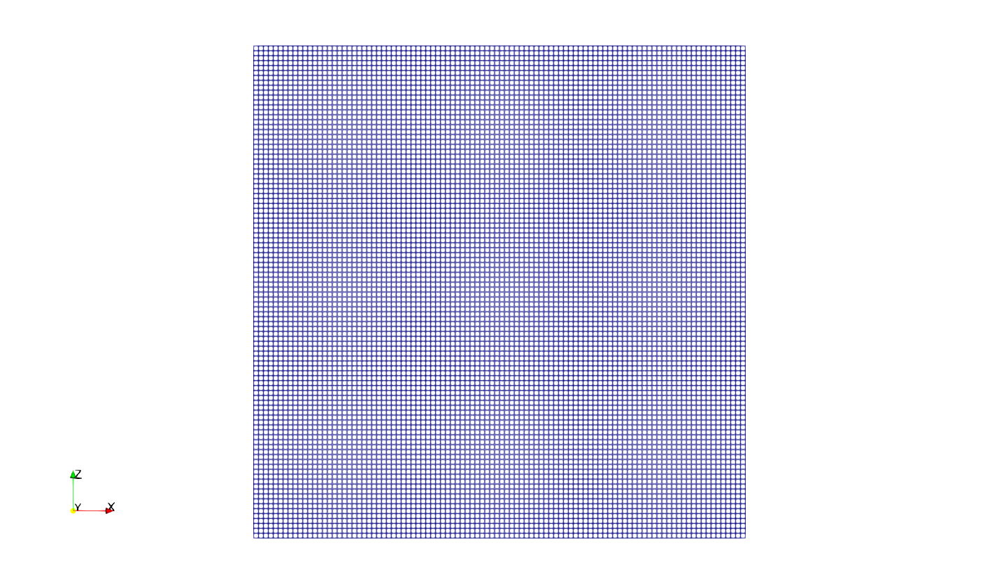
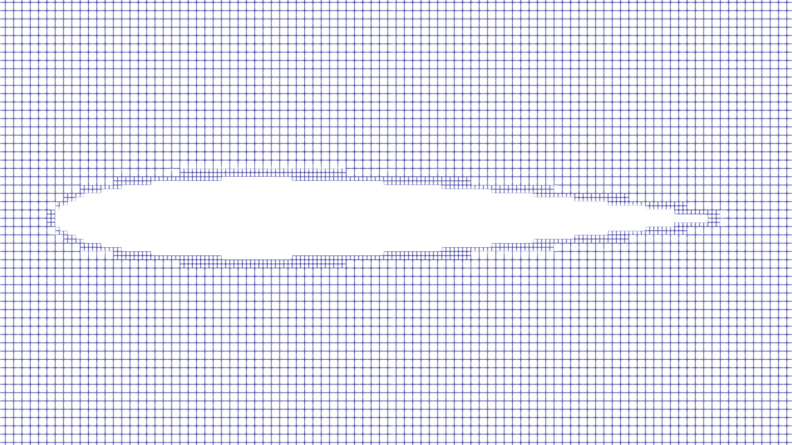
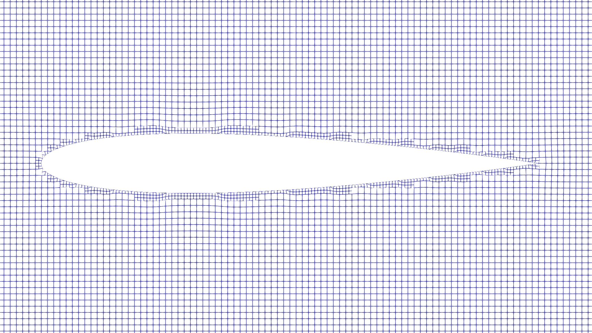
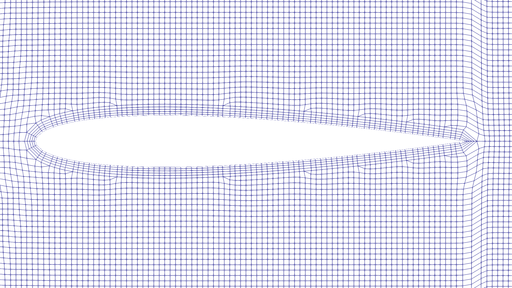
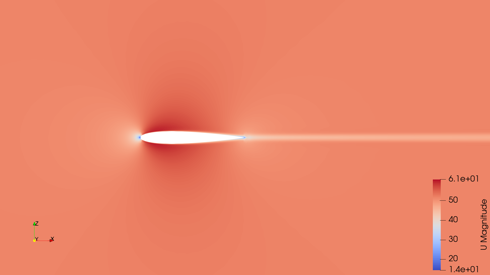
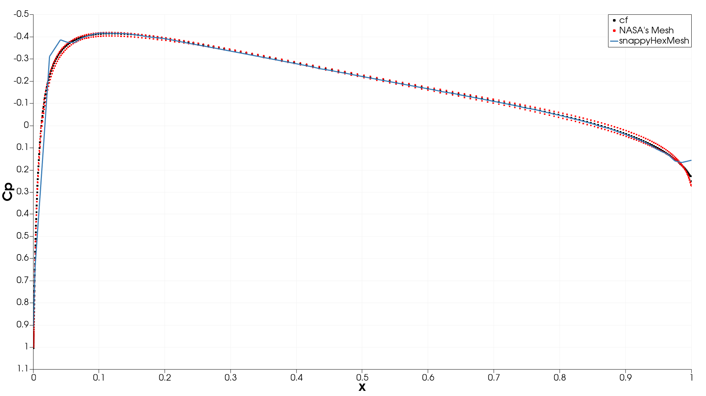

# Tutorial 6.2 – Flow over NACA0012 Airfoil with SnappyHexMesh

##  Table of Contents
- [Tutorial 6.2 – Flow over NACA0012 Airfoil with SnappyHexMesh](#tutorial-62--flow-over-naca0012-airfoil-with-snappyhexmesh)
  - [Table of Contents](#table-of-contents)
  - [Introduction](#introduction)
  - [Preparing the Case Directory](#preparing-the-case-directory)
  - [Preparing the Geometry](#preparing-the-geometry)
  - [Creating the Background Mesh](#creating-the-background-mesh)
  - [Configuring and Understanding snappyHexMesh](#configuring-and-understanding-snappyhexmesh)
    - [Castellated Mesh](#castellated-mesh)
    - [Snapping](#snapping)
    - [Adding Layers](#adding-layers)
  - [Running the Case and Post-Processing](#running-the-case-and-post-processing)
  - [Visualizing the Results](#visualizing-the-results)
  - [Validating the Solution](#validating-the-solution)
  - [References](#references)


## Introduction

`SnappyHexMesh` is a robust meshing tool integrated within **OpenFOAM**. It enables us to generate high-quality, hex-dominant meshes suitable for complex geometries. The process begins with a simple background mesh, which is then refined and snapped to our geometry of interest. 

Here’s a brief overview of the key steps involved:
- Background Mesh Creation: We start with a coarse background mesh created using the `blockMesh` utility.
- Geometry Description: The geometry is described using surface files, such as STL or OBJ files.
- Mesh Refinement: The mesh is refined near the geometry based on specified settings.
- Snapping: Mesh points are snapped to the surface geometry to ensure an accurate representation.
- Layer Addition: Optional boundary layers can be added to better capture near-wall flow effects.
- 
This approach allows us to generate meshes that accurately represent complex geometries while maintaining high cell quality and appropriate resolution. For a more detailed explanation and comprehensive guidance on using `snappyHexMesh`, refer to the **OpenFOAM**'s [documentation](https://doc.cfd.direct/openfoam/user-guide-v11/snappyhexmesh).

Let’s dive into each of these steps in detail.

## Preparing the Case Directory

In this section, we will set up our case for using `snappyHexMesh`.

First, we will copy the existing airfoil case that we have already set up:

```bash
cp -r $FOAM_RUN/airfoil_naca0012 $FOAM_RUN/airfoil_naca0012_snappy
```

```bash
cd $FOAM_RUN/airfoil_naca0012_snappy
```

We need to clean the case by removing the solution directories, the existing geometry, and the log files. This can be done manually or using the 'foamCleanCase' command. 

```bash
foamCleanCase
```

```bash 
rm -rf logs
```

## Preparing the Geometry

Now, we need to set up the geometry and the necessary files for defining `snappyHexMesh`.

**OpenFOAM** provides the geometry of the NACA0012 airfoil, but we can also generate it ourselves in STL or OBJ formats. The geometry file should be placed in the geometry directory within the constant directory.

Use the following command to copy the provided geometry:

```bash
mkdir $FOAM_RUN/airfoil_naca0012_snappy/constant/geometry
```

```bash
cp $FOAM_TUTORIALS/resources/geometry/NACA0012.obj.gz $FOAM_RUN/airfoil_naca0012_snappy/constant/geometry
```

Next, we need to unzip the geometry file:

```bash
gunzip $FOAM_RUN/airfoil_naca0012_snappy/constant/geometry/NACA0012.obj.gz
```

With the case copied and cleaned, and the geometry prepared, we are now ready to proceed with setting up the `snappyHexMesh` dictionary and running the mesh generation. 

To set up our case for `snappyHexMesh`, we will need some example files from an existing tutorial. We'll search for a suitable tutorial setup for incompressible flow using the following command:

```bash
grep -r "snappyHexMesh" $FOAM_TUTORIALS/incompressibleFluid
```

From the search results, we will use the motorBike example. Copy the following files from this example:

```bash
cp $FOAM_TUTORIALS/incompressibleFluid/motorBikeSteady/system/snappyHexMeshDict $FOAM_RUN/airfoil_naca0012_snappy/system
cp $FOAM_TUTORIALS/incompressibleFluid/motorBikeSteady/system/meshQualityDict $FOAM_RUN/airfoil_naca0012_snappy/system
cp $FOAM_TUTORIALS/incompressibleFluid/motorBikeSteady/system/surfaceFeaturesDict $FOAM_RUN/airfoil_naca0012_snappy/system
cp $FOAM_TUTORIALS/incompressibleFluid/motorBikeSteady/system/blockMeshDict $FOAM_RUN/airfoil_naca0012_snappy/system
```

## Creating the Background Mesh

We will start by creating a simple box domain that is 10x1x10 meters. This domain is smaller than the one used by NASA, as we are only experimenting with the utility and can tolerate boundary effects. The mesh will have 100x1x100 cells, giving a base grid size of 0.1 meters.

Here is the content for the 'system/blockMeshDict' file:

```cpp
convertToMeters 1;

vertices
(
    (-4 -0.5 -5) //0
    ( 6 -0.5 -5) //1
    ( 6  0.5 -5) //2
    (-4  0.5 -5) //3
    
    (-4 -0.5  5) //4
    ( 6 -0.5  5) //5
    ( 6  0.5  5) //6
    (-4  0.5  5) //7
);

blocks
(
    hex (0 1 2 3 4 5 6 7) (100 1 100) simpleGrading (1 1 1)
);

boundary
(
    front
    {
        type patch;
        faces
        (
            (2 3 7 6)
        );
    }
    back
    {
        type patch;
        faces
        (
            (0 1 5 4)
        );
    }
    inlet
    {
        type patch;
        faces
        (
            (0 4 7 3)
            (0 3 2 1)
            (4 5 6 7)
        );
    }
    outlet
    {
        type patch;
        faces
        (
            (1 2 6 5)
        );
    }
);
```

Navigate to your case directory and run `blockMesh` to create the initial background mesh:

```bash
blockMesh
```



## Configuring and Understanding snappyHexMesh

In this section, we will delve into the 'snappyHexMeshDict' file and discuss the three main steps involved in the meshing process: castellated mesh generation, snapping, and adding layers.

Open the 'snappyHexMeshDict' file in your preferred text editor to explore its contents. 

The three main steps in the meshing process are controlled by the following options:

1. castellatedMesh
2. snap          
3. addLayers

Let's discuss each of these steps in detail.

### Castellated Mesh
The first step is the creation of the castellated mesh. This process involves creating a coarse, blocky approximation of the geometry. Setting 'castellatedMesh' to true enables this step.

```cpp
castellatedMesh true;
```

During this step, the background mesh is refined according to the settings provided in the 'snappyHexMeshDict' file. The geometry is approximated with a series of hexahedral (hex) cells. This step lays the foundation for more accurate mesh generation in the subsequent steps.

The geometry section of the 'snappyHexMeshDict' file defines the input geometry and any additional regions that need to be considered during the mesh generation process. Here’s the configuration we use for our NACA0012 airfoil case:

```cpp
geometry
{
    walls
    {
        type triSurfaceMesh;
        file "NACA0012.obj";
    }

    refinementBox
    {
        type searchableBox;
        min (-0.5 -0.5 -1.0);
        max ( 6.0  0.5  1.0);
    }
};
```

The 'walls' entry defines the main geometry of our airfoil. It specifies the type of the geometry as 'triSurfaceMesh', which is typical for STL and OBJ files, and contains the filename of the geometry file. Here, we use "NACA0012.obj".

The 'refinementBox' entry allows us to specify an area around the airfoil where the mesh should be more refined. The  'searchableBox' region indicates that this is a box-shaped region that can be searched within the domain. 

Before running `snappyHexMesh`, we need to generate the edge mesh using the `surfaceFeatures` utility. This edge mesh captures the sharp features of the geometry, which are crucial for accurate mesh refinement. The configuration for this utility is defined in the 'surfaceFeaturesDict' file. Here is the setup used:

```cpp
surfaces ("NACA0012.obj");

includedAngle 150;

subsetFeatures
{
    nonManifoldEdges no;
    openEdges yes;
}
```

The 'includedAngle' defines the angle threshold to consider edges as features. Edges with angles smaller than this value will be included.

To run `surfaceFeatures`, use the following command:

```bash
surfaceFeatures
```

This will generate the 'NACA0012.eMesh' file, which we will use in the features section of the 'snappyHexMeshDict'.

With the edge mesh generated, we can now configure the 'castellatedMeshControls' section in the 'snappyHexMeshDict' file:

```cpp
castellatedMeshControls
{
    // Refinement parameters
    maxLocalCells 100000;
    maxGlobalCells 2000000;
    minRefinementCells 10;
    maxLoadUnbalance 0.10;
    nCellsBetweenLevels 3;

    // Explicit feature edge refinement
    features
    (
        {
            file "NACA0012.eMesh";
            level 5;
        }
    );

    // Surface based refinement
    refinementSurfaces
    {
        walls
        {
            level (4 4);
            patchInfo
            {
                type wall;
            }
        }
    }

    // Resolve sharp angles
    resolveFeatureAngle 30;

    // Region-wise refinement
    refinementRegions
    {
        refinementBox
        {
            mode inside;
            level 3;
        }
    }

    // Mesh selection
    insidePoint (-3.0001 0.0 0.0);

    allowFreeStandingZoneFaces true;
}
```

Let's discuss each part of this configuration in detail.

1. The features entry specifies the edge mesh file and the refinement level for the features:

    ```cpp
    features
    (
        {
            file "NACA0012.eMesh";
            level 5;
        }
    );
    ```

   The 'level' entery defines the refinement level for the feature edges. A higher level results in finer mesh refinement.

   The refinement level is defined such that the local grid size is made smaller according to the following equation:

    ```math
    local_grid_size = \frac{base_grid_size}{2^{refinement_level}}
    ```

1. The 'refinementSurfaces' entry defines the refinement levels for the geometry surfaces:
    
    ```cpp
    refinementSurfaces
    {
        walls
        {
            level (4 4);
            patchInfo
            {
                type wall;
            }
        }
    }
    ```

    The 'walls' entery refers to the surface defined in the geometry section. Both minimum and maximum refinement levels are set to 3, and additional information about the surface patch is given, such as its type.

2. The 'resolveFeatureAngle' parameter ensures that sharp angles in the geometry are accurately resolved:
   
    ```cpp
    resolveFeatureAngle 30;
    ```
   
   Angles smaller than this value will be refined.

3. The 'refinementRegions' entry allows for specific regions within the domain to be refined:
   
    ```cpp
    refinementRegions
    {
        refinementBox
        {
            mode inside;
            level 3;
        }
    }
    ```
    
    The 'refinementBox' refers to the box region defined in the geometry section. The 'inside' mode means refinement will occur inside the specified box. 

4. The 'insidePoint' parameter helps the meshing algorithm distinguish between the interior and exterior of the geometry:

    ```cpp
    insidePoint (-3.0001 0.0 0.0);
    ```

This will create a coarse, refined mesh around the NACA0012 airfoil geometry, ready for further refinement and snapping in subsequent steps.




### Snapping
The second step is the snapping process. This step refines the initial coarse mesh generated in the castellated mesh step by aligning the mesh points to the geometry surfaces. This process is controlled by the 'snapControls' section within the 'snappyHexMeshDict' file. Setting 'snap' to true enables this step.

```cpp
castellatedMesh true;
snap true;
```

```cpp
snapControls
{
    nSmoothPatch 3;
    tolerance 2.0;
    nSolveIter 30;
    nRelaxIter 5;
    nFeatureSnapIter 10;
    implicitFeatureSnap false;
    explicitFeatureSnap true;
    multiRegionFeatureSnap false;
}
```

During snapping, the mesh points are moved to fit the actual geometry surfaces more accurately. This results in a mesh that conforms more closely to the geometry, improving the fidelity of the simulation.



### Adding Layers

To accurately resolve the boundary layer, we need a very fine mesh close to the wall. By using prism or inflation layers, we can achieve a fine cell size in the normal direction to the wall while keeping larger cells parallel to the wall, where the gradient is smaller. This approach helps in reducing the total number of cells while maintaining high resolution near the wall.

To add these layers, we need to enable the layer addition feature in the 'snappyHexMeshDict':

```cpp
castellatedMesh true;
snap true;
addLayers true;
```

The configuration for adding layers is controlled by the addLayersControls section. Here is the setup used:

```cpp
addLayersControls
{
    relativeSizes true;

    layers
    {
        walls
        {
            nSurfaceLayers 5;
        }
    }

    expansionRatio 1.1;
    finalLayerThickness 0.5;
    minThickness 1e-6;
    nGrow 0;

    // Advanced settings
    featureAngle 60;
    slipFeatureAngle 30;
    nRelaxIter 3;
    nSmoothSurfaceNormals 1;
    nSmoothNormals 3;
    nSmoothThickness 10;
    maxFaceThicknessRatio 0.5;
    maxThicknessToMedialRatio 0.3;
    minMedianAxisAngle 90;
    nBufferCellsNoExtrude 0;
    nLayerIter 50;
}
```

Let's discuss the parameters in detail.

1. When 'relativeSizes' set to true, the layer thicknesses are specified relative to the local cell size.
2. The 'layers' entry specifies the surfaces and the number of layers to add. Here, 5 layers will be added to the 'walls' boundary.
3. The 'expansionRatio' entery determines the growth rate of the layer thickness. An expansion ratio of 1.1 means each subsequent layer will be 1.1 times thicker than the previous one.
4. The 'finalLayerThickness' entery specifies the thickness of the final layer relative to the local cell size.
5. The 'minThickness' entery defines the minimum allowable thickness for a layer. This helps prevent excessively thin layers.
6. The 'featureAngle' entery determines the angle (in degrees) at which additional layers are added to resolve sharp features.

To ensure that the surface refinement does not interfere with the inflation layer generation, we will set the refinement level of the walls surface to match the level of the 'refinementBox'.

```cpp
refinementSurfaces
{
    walls
    {
        level (3 3);
        patchInfo
        {
            type wall;
        }
    }
}
```

Run `snappyHexMesh`:

```cpp
snappyHexMesh -overwrite
```



We successfully achieved 5 layers, but the mesh above the layers became more distorted, especially around the sharp trailing edge of the airfoil, which is the most challenging area for layer generation.

However, this is not the end of the meshing process. The `snappyHexMesh` utility generates 3D meshes. To modify it to 2D, we will use the `extrudeMesh` utility.

First, we need to copy the file 'extrudeMeshDict' from the tutorials:

```bash
grep -r "extrudeMesh" $FOAM_TUTORIALS/incompressibleFluid
```

```bash
cp $FOAM_TUTORIALS/incompressibleFluid/wingMotion/wingMotion2D_steady/system/extrudeMeshDict $FOAM_RUN/airfoil_naca0012_snappy/system
```

Here is the content for the 'system/extrudeMeshDict' file:

```cpp
constructFrom patch;
sourceCase "$FOAM_CASE";

sourcePatches (back);
exposedPatchName front;

extrudeModel  plane;
thickness     1.0;

flipNormals false;
mergeFaces false;
```

The 'extrudeMeshDict' file controls how the extrusion of a mesh is performed. Let's break down the key parameters:

1. sourceCase: Refers to the case directory where the source mesh is located.
2. sourcePatches: Lists the patches from which the mesh will be extruded.
3. exposedPatchName: Names the patch that will be exposed after extrusion.
4. extrudeModel: Determines the type of extrusion. 'plane' is used here to create a single layer linear extrusion in point-normal direction with empty patches on front and back.
5. thickness: Specifies the thickness of the extrusion.

After copying and setting up the 'extrudeMeshDict' file, execute the `extrudeMesh` utility to convert your 3D mesh into a 2D representation. 

```bash
extrudeMesh
```

## Running the Case and Post-Processing

We now can run the case:

```bash
foamRun > log.foamRun &
```

Next, we will execute our post-process script:

```bash
bash ./Lastpost
```

## Visualizing the Results

The flow over the NACA0012 airfoil can be visualized to understand the U magnitude distribution for our mesh setup:



## Validating the Solution

To ensure the accuracy of our simulation, we can compare the results from the snappyHex mesh with NASA's mesh and experimental data:



The coarse mesh obtained using `snappyHexMesh` appears to follow the overall trend of the experimental and NASA data, showing a reasonable prediction of the pressure distribution in most regions of the airfoil. There are deviations at the very edges due to mesh density or resolution differences, which can impact how well sharp gradients are captured. Through the mid-section of the airfoil, the `snappyHexMesh` result maintains a close alignment with the experimental data.

## References

[https://turbmodels.larc.nasa.gov/naca0012_val.html](https://turbmodels.larc.nasa.gov/naca0012_val.html)

[https://www.openfoam.com/documentation/guides/latest/doc/verification-validation-naca0012-airfoil-2d.html](https://www.openfoam.com/documentation/guides/latest/doc/verification-validation-naca0012-airfoil-2d.html)

[https://doc.cfd.direct/openfoam/user-guide-v11/snappyhexmesh#x29-1620005.5](https://doc.cfd.direct/openfoam/user-guide-v11/snappyhexmesh#x29-1620005.5)

[http://www.wolfdynamics.com/wiki/meshing_OF_SHM.pdf](http://www.wolfdynamics.com/wiki/meshing_OF_SHM.pdf)